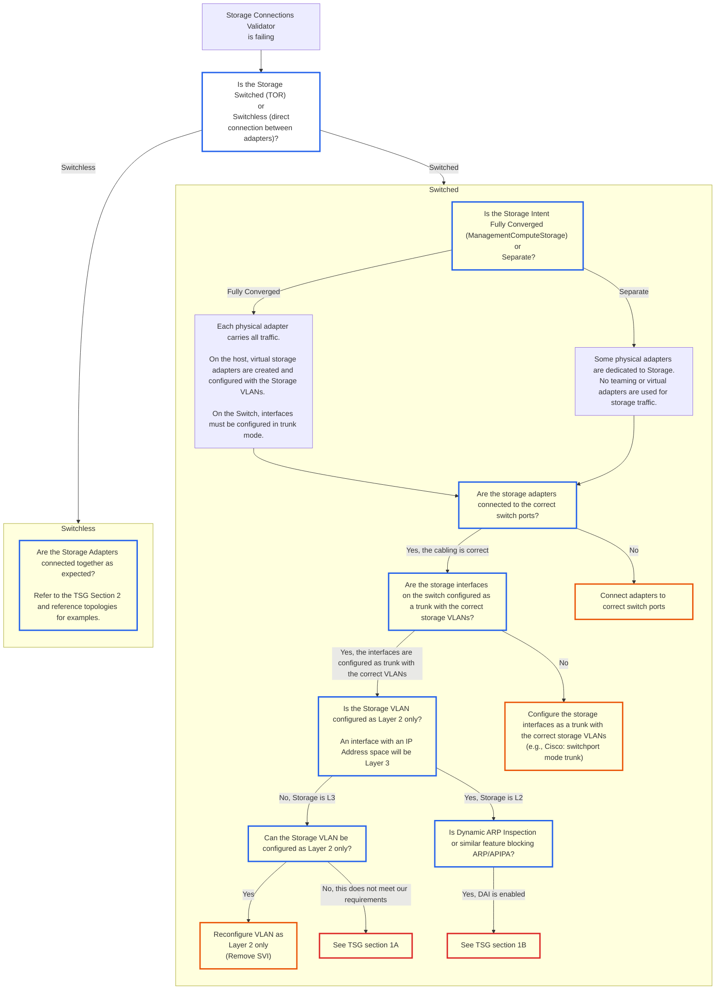

# AzStackHci_Network_Test_StorageConnections_ConnectivityCheck

<table border="1" cellpadding="6" cellspacing="0" style="border-collapse:collapse; margin-bottom:1em;">
  <tr>
    <th style="text-align:left; width: 180px;">Name</th>
    <td><strong>AzStackHci_Network_Test_StorageConnections_ConnectivityCheck</strong></td>
  </tr>
  <tr>
    <th style="text-align:left; width: 180px;">Severity</th>
    <td><strong>Critical</strong>: This validator will block operations until remediated.</td>
  </tr>
  <tr>
    <th style="text-align:left;">Applicable Scenarios</th>
    <td><strong>Deployment</strong></td>
  </tr>
</table>

## Overview

This validation check fails when the Storage Adapters (network adapters used in the Storage Network Intent) do not have the expected network connectivity. Common causes include:

- Storage Adapters are incorrectly cabled
- TOR (Top of Rack) switch is misconfigured

## Requirements

The Storage Adapters must be able to reach each other, based on the configurations below. This is validated using Ping (ICMP) and the Storage Adapter's APIPA address.

### Switchless Storage Configuration

Identify your network reference pattern and ensure that the Storage Adapters are properly cabled and configured according to the requirements:

- [2 Node, Storage Switchless](https://learn.microsoft.com/en-us/azure/azure-local/plan/two-node-switchless-two-switches)
- [3 Node, Storage Switchless, Dual TOR, Single link](https://learn.microsoft.com/en-us/azure/azure-local/plan/three-node-switchless-two-switches-single-link)
- [3 Node, Storage Switchless, Dual TOR, Dual link](https://learn.microsoft.com/en-us/azure/azure-local/plan/three-node-switchless-two-switches-two-links)
- [4 Node, Storage Switchless, Dual TOR, Dual link](https://learn.microsoft.com/en-us/azure/azure-local/plan/four-node-switchless-two-switches-two-links)

### Switch-based Storage Configuration

Identify your network reference pattern and ensure that the Storage Adapters are properly cabled and that the VLAN and TOR switch are configured according to the requirements:

- [2 Node, Storage Switched, Non-Converged](https://learn.microsoft.com/en-us/azure/azure-local/plan/two-node-switched-non-converged)
- [2 Node, Storage Switched, Fully-Converged](https://learn.microsoft.com/en-us/azure/azure-local/plan/two-node-switched-converged)

### Reference TOR Configurations

- [2 Node, Switchless Storage TOR Configuration](../../Networking/Top-Of-Rack-Switch/Reference-TOR-2Node-Switchless-Storage.md)
- [Disaggregated Switched Storage TOR Configuration](../../Networking/Top-Of-Rack-Switch/Reference-TOR-Disaggregated-Switched-Storage.md)
- [Fully Converged Storage TOR Configuration](../../Networking/Top-Of-Rack-Switch/Reference-TOR-Fully-Converged-Storage.md)


## Troubleshooting Steps

### Review Environment Validator Output

Review the Environment Validator output JSON. Check the `AdditionalData.Detail` field for summary of which Hosts are not configured properly. You can identify the host by the `TargetResourceID` field.

Here is an example:

```json
{
  "Name": "AzStackHci_Network_Test_StorageConnections_ConnectivityCheck",
  "DisplayName": "Validate that the Storage Adapters on each node can reach their connected adapters on other nodes.",
  "Tags": {},
  "Title": "Validate that the Storage Adapters on each node can reach their connected adapters on other nodes.",
  "Status": 1,
  "Severity": 2,
  "Description": "The Storage Adapters on each node must be able to reach their connected adapters on other nodes, based on the expected network topology. This topology is determined by the Intent and Switch/Switchless configuration. Connectivity is tested using ICMP (ping) between the APIPA addresses of the Storage Adapters.",
  "Remediation": "https://aka.ms/azurelocal/envvalidator/storageconnections",
  "TargetResourceID": "azloc-node3",
  "TargetResourceName": "azloc-node3",
  "TargetResourceType": "StorageAdapterConnection",
  "Timestamp": "/Date(1749592635804)/",
  "AdditionalData": {
    "Detail": "azloc-node3 (0/2 checks passed): ethernet 4[169.254.138.15] to azloc-node1/ethernet 4[169.254.38.73] = FAIL, ethernet 3[169.254.74.115] to azloc-node1/ethernet 3[169.254.246.79] = FAIL",
    "Status": "FAILURE",
    "TimeStamp": "06/10/2025 21:57:15",
    "Resource": "StorageAdapterConnection",
    "Source": "azloc-node3"
  },
  "HealthCheckSource": "Manual\\Standard\\Medium\\Network\\13d8dbb9"
}
```

### Failure: `hostname (x/x checks passed): adapter1[x.x.x.x] to hostname/adapter2[x.x.x.x] = FAIL`

This indicates that the storage adapter on host 'hostname' (e.g., ethernet 4) is unable to ping the other storage adapter (e.g., ethernet 3) at the specified IP address.

#### Example (separate Storage Intent)

```text
azloc-node3 (0/2 checks passed): ethernet 4[169.254.138.15] to azloc-node1/ethernet 4[169.254.38.73] = FAIL, ethernet 3[169.254.74.115] to azloc-node1/ethernet 3[169.254.246.79] = FAIL
```

This example has two failures, both involving azloc-node3 attempting to reach azloc-node1. Here is the breakdown of the first failure:

- Source Host: `azloc-node3`
- Source Adapter: `ethernet 4`
- Source IP: `169.254.138.15`
- Target Host: `azloc-node1`
- Target Adapter: `ethernet 4`
- Target IP: `169.254.38.73`

#### Example (converged Compute and Storage Intent)

```text
azloc-node1 (1/2 checks passed): vStorage(ethernet)[169.254.0.1] to azloc-node2/vStorage(ethernet)[169.254.0.3] = FAIL
```

In converged Compute and Storage Intent environments, on each node, a temporary Virtual Switch is created using the Storage Adapters. A Virtual Network Interface is created using the Virtual Switch, and connectivity is validated through this interface. The switch and interface are removed after the validation is complete.

#### Remediation Steps

Work through the following flow chart, focussing on the connections that failed:



#### Section 1) Troubleshoot Storage Switched Configurations

**1A) Storage cannot be configured as Layer 2 only**

If Storage cannot be configured at Layer 2 only, then the APIPA address (169.254.0.0/16) space must be temporarily included in the Storage VLANs address space.

As soon as deployment completes, this configuration can be removed.

**1B) Dynamic ARP Inspection (DAI) is enabled**

Dynamic ARP Inspection (DAI) is a Cisco feature that prevents ARP spoofing by validating ARP packets. If DAI is enabled, it may block the APIPA addresses used by the Storage Adapters. Other vendors have similar features. Since the APIPA protocol relies on ARP, this will cause the StorageConnections_PingMesh validation to fail.

To mitigate this issue, you can temporarily trust the Storage Interfaces. On Cisco switches, this can be done with the command `ip arp inspection trust` on the Storage Interfaces.

As soon as deployment completes, this configuration can be removed.

---

#### Section 2) Troubleshoot Storage Switchless Configurations (direct connections between Storage NICs)

In Switchless deployments, the Storage Traffic is sent directly between NICs. This reduces load on the TOR and is easier to manage. Scale Out operations are not supported on switchless environments.

If this validator is failing, it is likely because the PNICs are not correctly cabled. Review the reference diagrams from the [Requirements](#requirements) section to ensure proper cabling.

## How to validate storage connectivity

### Run Environment Validator Locally

The simplest way to validate any configuration changes is to run the Network Environment Validator locally.

For instructions on running `Invoke-AzStackHciNetworkValidation`, see the `Network` tab on [Evaluate the deployment readiness of your environment for Azure Local](https://learn.microsoft.com/en-us/azure/azure-local/manage/use-environment-checker).

### Manual Validation

In some cases you may need to validate the Storage Connectivity manually. Refer to the steps below for guidance.

#### Converged (ComputeManagementStorage) deployments

In converged deployments, the Storage Connections validator will create a temporary VM Switch and VM Network Adapters to test connectivity. To replicate this:

1. Create a Temporary VM Switch, teaming the two physical NICs. Note that this may cause network disruption. Make sure you have access to the host via another management interface, such as iDRAC or BMC.

   ```powershell
   $adapters = @("ethernet", "ethernet 2") # <-- replace with your physical NIC names
   $switchName = "Test-Switch"
   New-VMSwitch -Name $switchName -NetAdapterName $adapters -EnableEmbeddedTeaming $true -AllowManagementOS $true
   Get-VMSwitch $switchName
   ```

2. On each host, create the VM Network Adapters for each PNIC

   ```powershell
   $storageVlans = @("711", "712") # <-- replace with your storage VLANs
   $switchName = "Test-Switch"

   foreach ($vlan in $storageVlans) {
       $tmpStorageVNIC = "VMNet-$vlan"
       Add-VMNetworkAdapter -ManagementOS -SwitchName $switchName -Name $tmpStorageVNIC
       Get-NetAdapter -name "vEthernet ($($tmpStorageVNIC))" -ErrorAction SilentlyContinue | Rename-NetAdapter -NewName $tmpStorageVNIC
       Set-NetIPInterface -InterfaceAlias $tmpStorageVNIC -Dhcp Disabled
       Set-DnsClient -InterfaceAlias $tmpStorageVNIC -RegisterThisConnectionsAddress $false
       Set-VMNetworkAdapterIsolation -ManagementOS -VMNetworkAdapterName $tmpStorageVNIC -IsolationMode Vlan -AllowUntaggedTraffic $true -DefaultIsolationID $vlan
   }
   Get-VMNetworkAdapter -ManagementOS | Format-Table Name, SwitchName, MacAddress
   ```

3. On each host, from each VM Network Adapter, ping the other host's _corresponding_ VM Network Adapter using its APIPA IP Address. For example, Host1 VMNet-711 should ping Host2 VMNet-711, and Host1 VMNet-712 should ping Host2 VMNet-712.

   ```powershell
   # get the ipconfiguration of the VM Network Adapter
   Get-NetIPConfiguration -InterfaceAlias "VMNet*" | % { [pscustomobject]@{Alias=$_.InterfaceAlias;IP=$_.IPv4Address.IPAddress;MAC=(Get-NetAdapter -InterfaceIndex $_.InterfaceIndex).MacAddress} } | ft -AutoSize

   # Example for VMNet-711
   ping <VMNet-711 on Host2 IP> -S <VMNet-711 on Host1 IP> -n 10
   ```

4. If any ping fails, check the following:

   - That the VLANs are correctly configured on the TOR switches. In a converged deployment, both storage VLANs should be configured on the interface.
   - That physical NICs are connected to the correct ports on the TOR switches.
   - That no VLANs are configured on the physical NICs.
   - That no firewall rules or other configuration are blocking APIPA traffic.
   - Verify that the TOR switches have correctly learned the MAC addresses of the VM Network Adapters by checking their ARP or MAC address tables.

5. Cleanup the temporary VM Switch and Network Adapters after testing:

   ```powershell
   $switchName = "Test-Switch"
   Get-VMNetworkAdapter -ManagementOS | Remove-VMNetworkAdapter
   Get-VMSwitch -Name $switchName | Remove-VMSwitch
   ```

#### Separate Storage (ComputeManagement + Storage) deployments

1. Temporarily configure the Storage VLAN on each Storage Adapter on each node

   ```powershell
   $storageAdapters = @("ethernet 3", "ethernet 4") # <-- replace with your storage adapter names
   $storageVlans = @("711", "712") # <-- replace with your storage VLANs

   foreach ($adapterName in $storageAdapters) {
       $vlanId = $storageVlans[$storageAdapters.IndexOf($adapterName)]
       Set-NetAdapterAdvancedProperty -Name $adapterName -RegistryKeyword "VLANID" -RegistryValue $vlanId
   }
   ```

2. Ping the corresponding adapter on each other node

   Use `ping` to verify that the Storage Adapters can reach each other. Environment Validator generates a mapping of each adapter's IP. When performing the validation manually, it's easiest to use the `ipconfig` command to find the IP addresses of the storage adapters.

   ```powershell
   # find the IP addresses of the storage adapters
   ipconfig

   # From azloc-node3 ethernet 4, ping azloc-node1 ethernet 4
   # -S specifies the source IP address
   ping 169.254.38.73 -S 169.254.138.15 -n 4
   ```

   If one specific ping is failing, double review the flow chart above, focussing on the specific adapter and its TOR configuration.

3. Remove the temporary VLAN configuration from each Storage Adapter on each node

   ```powershell
   $storageAdapters = @("ethernet 3", "ethernet 4") # <-- replace with your storage adapter names

   foreach ($adapterName in $storageAdapters) {
       Set-NetAdapterAdvancedProperty -Name $adapterName -RegistryKeyword "VLANID" -RegistryValue 0
   }
   ```

#### Switchless deployments

In switchless deployments, you can use ping to verify connectivity between the storage adapters. Reference the [Requirements](#requirements) section for the expected cabling. Depending on which Switchless topology you have deployed, which adapter connects to which other adapter will vary.

   ```powershell
   # find the IP addresses of the storage adapters
   ipconfig

   # Ping the corresponding adapter on the other node
   # -S specifies the source IP address
   ping 169.254.38.73 -S 169.254.138.15 -n 4
   ```