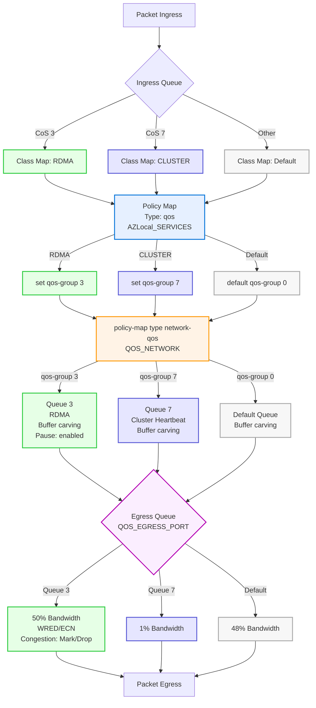

# Disaggregated Switch Storage Design


- [Disaggregated Switch Storage Design](#disaggregated-switch-storage-design)
  - [Scope](#scope)
  - [Terminology](#terminology)
  - [Example Device](#example-device)
  - [Environment](#environment)
  - [Attributes](#attributes)
    - [Nodes](#nodes)
    - [Switch](#switch)
  - [Cable Map](#cable-map)
    - [Node 1](#node-1)
    - [Node 2](#node-2)
    - [TOR 1](#tor-1)
    - [TOR 2](#tor-2)
  - [Switch Configuration Overview](#switch-configuration-overview)
    - [QoS](#qos)
    - [Compute, Management, Storage Network Intents](#compute-management-storage-network-intents)
  - [ToR Configuration](#tor-configuration)
    - [Enabled Capabilities](#enabled-capabilities)
    - [QoS Policy](#qos-policy)
      - [ClassMap](#classmap)
      - [policy-map qos](#policy-map-qos)
      - [policy-map type network-qos](#policy-map-type-network-qos)
      - [policy-map type queuing](#policy-map-type-queuing)
    - [Loop prevention](#loop-prevention)
    - [VLAN](#vlan)
  - [Example SDN Configuration](#example-sdn-configuration)
  - [Layer 3 Forwarding Gateway](#layer-3-forwarding-gateway)
  - [References Documents](#references-documents)

## Scope

This document assists administrators in designing a network architecture that aligns with Azure Local cluster requirements. It provides reference architectures and sample configurations for network devices supporting cluster deployments. Equipment such as switches, firewalls, or routers located on customer premises is considered out of scope, as it is assumed to be part of the existing infrastructure. The focus is on Node-to-ToR, ToR-to-ToR, and ToR uplink configurations.

## Terminology

Definitions
: **ToR**: Top of Rack network switch.  Supporting Management, Compute and Storage intent traffic.
: **p-NIC**: Physical Network Interface Card attached to a Azure Local node.
: **v-Switch**: Virtual Switch configured on the Azrue Local Cluster.
: **VLAN**: Virtual Local Area Network.
: **SET**: [Switch Embedded Teaming][Teaming_in_Azure_Stack_HCI], supporting switch-independant teaming.
: **MLAG**: Multi-Chassis Link Aggregation, a technique that lets two or more network switches work together as if they were one logical switch.
: **Border Router**: Uplink device with the ToR switches, providing routing to endpoints external to the Azure Local environment.
: **AS**: Autonomous System number used to define a BGP neighbor.
: **WRED**: Weighted Random Early Detection, this is a congestion avoidance mechanism used in QOS policies.
: **ECN**: Explicit Congestion Notification, this is a congestion notification mechanism used to mark packets when congestion is encountered in the communication path.  A DSCP bit is modified in the packet to identify congestion.

## Example Device

- Make: Cisco
- Model: Nexus 98180YC-FX
- Firmware: 10.3 or greater

## Environment

This document will discuss a 2 - 16 node envionrment where the Management and Compute network intents share a SET team interface.  Storage1 and Storage2 network intents are utilizing issloated network interfaces and connect to a switch to support storage traffic.

Within this environment there are two ToR devcies (TOR1 and TOR2).  Both of these devices are connected to each other using a MLAG configuration and a dedicated port-channel for MLAG heartbeat and iBGP routing.

The TOR devices are setup as a Layer2/Layer3 device within an iBGP configuration.

## Attributes

### Nodes

Each node is equipped with two physical network interface cards, each with two physical interfaces (p-NICs).
- <span style="color: #0078D4; font-size: 1.2em;">&#9632;</span> p-NICs A and B handle both compute and management intent traffic.
- <span style="color: #0078D4; font-size: 1.2em;">&#9632;</span> p-NIC interfaces support 25G bandwidth.
- <span style="color: #0078D4; font-size: 1.2em;">&#9632;</span> p-NICs A and B are configured as part of a Switch Embedded Teaming (SET) team, transmitting compute and management traffic. These NICs are assigned to a virtual switch (v-Switch) to support multiple network intents.  Managment intent traffic is untagged, and Compute traffic is tagged.
- <span style="color:rgb(158, 95, 241); font-size: 1.2em;">&#9632;</span> p-NICs C and D are dedicated to storage intent traffic and are RDMA capable devices.
- <span style="color:rgb(158, 95, 241); font-size: 1.2em;">&#9632;</span> p-NICs C and D can support RoCEv2 or iWARP.
- <span style="color:rgb(158, 95, 241); font-size: 1.2em;">&#9632;</span> p-NICs C and D are connect to the ToR devices, the default vlan 711 will be assigned to p-NIC C and VLAN 712 will be assigned to p-NIC D.  The interfaces will operate in trunk mode and only one storage intent VLAN is assigned per interface.  Native VLAN not supported in this configuration, any Native VLAN traffic will be dropped.

> [!IMPORTANT]
> If your Azure Local environment uses iWARP-based network cards and you enable Jumbo Frames, ensure that Jumbo Frames are also enabled on all switch interfaces and network paths carrying Storage Intent traffic. For RoCEv2-based systems, enabling Jumbo Frames on the switch is not required for Storage Intent traffic.

### Switch

- TOR1 is in a MLAG configuration with TOR2, three interfaces are assigned to the MLAG peer link between the devices.  Peer link bandwidth will vary depending on the customer workloads.  
- MLAG support two network intents Management and Compute.  
- Layer 2 traffic is supported between the cluster nodes and the ToR devices.  External connectivity is only established via Layer 3 sessions.
- Storage intent traffic is issolated to a specific TOR and is not expected to travel between the TOR devcies.
- TOR1 and TOR2 operate as Layer2/Layer3 devices, Layer3 is supported by BGP as the primary routing protocol.
- TOR1 and TOR2 are configured to support an iBGP session, all external links are configured as eBGP sessions.

## Cable Map

The cable map is only showing two nodes within the example environment.

### Node 1

| Device    | Interface |      | Device | Interface    |
| --------- | --------- | ---- | ------ | ------------ |
| **Node1** | p-NIC A   | <==> | TOR1   | Ethernet1/1  |
| **Node1** | p-NIC B   | <==> | TOR2   | Ethernet1/1  |
| **Node1** | p-NIC C   | <==> | TOR1   | Ethernet1/15 |
| **Node1** | p-NIC D   | <==> | TOR2   | Ethernet1/15 |

### Node 2

| Device    | Interface |      | Device | Interface    |
| --------- | --------- | ---- | ------ | ------------ |
| **Node2** | p-NIC A   | <==> | TOR1   | Ethernet1/2  |
| **Node2** | p-NIC B   | <==> | TOR2   | Ethernet1/2  |
| **Node2** | p-NIC C   | <==> | TOR1   | Ethernet1/16 |
| **Node2** | p-NIC D   | <==> | TOR2   | Ethernet1/16 |

### TOR 1

| Device   | Interface    |      | Device  | Interface    |
| -------- | ------------ | ---- | ------- | ------------ |
| **TOR1** | Ethernet1/1  | <==> | Node1   | p-NIC A      |
| **TOR1** | Ethernet1/2  | <==> | Node2   | p-NIC A      |
| **TOR1** | Ethernet1/15 | <==> | Node1   | p-NIC C      |
| **TOR1** | Ethernet1/16 | <==> | Node2   | p-NIC C      |
| **TOR1** | Ethernet1/41 | <==> | TOR2    | Ethernet1/41 |
| **TOR1** | Ethernet1/42 | <==> | TOR2    | Ethernet1/42 |
| **TOR1** | Ethernet1/47 | <==> | Border1 | Ethernet1/x  |
| **TOR1** | Ethernet1/48 | <==> | Border2 | Ethernet1/x  |
| **TOR1** | Ethernet1/49 | <==> | TOR2    | Ethernet1/49 |
| **TOR1** | Ethernet1/50 | <==> | TOR2    | Ethernet1/50 |
| **TOR1** | Ethernet1/51 | <==> | TOR2    | Ethernet1/51 |

### TOR 2

| Device   | Interface    |      | Device  | Interface    |
| -------- | ------------ | ---- | ------- | ------------ |
| **TOR2** | Ethernet1/1  | <==> | Node1   | p-NIC B      |
| **TOR2** | Ethernet1/2  | <==> | Node2   | p-NIC B      |
| **TOR2** | Ethernet1/15 | <==> | Node1   | p-NIC D      |
| **TOR2** | Ethernet1/16 | <==> | Node2   | p-NIC D      |
| **TOR2** | Ethernet1/41 | <==> | TOR1    | Ethernet1/41 |
| **TOR2** | Ethernet1/42 | <==> | TOR1    | Ethernet1/42 |
| **TOR2** | Ethernet1/47 | <==> | Border1 | Ethernet1/x  |
| **TOR2** | Ethernet1/48 | <==> | Border2 | Ethernet1/x  |
| **TOR2** | Ethernet1/49 | <==> | TOR1    | Ethernet1/49 |
| **TOR2** | Ethernet1/50 | <==> | TOR1    | Ethernet1/50 |
| **TOR2** | Ethernet1/51 | <==> | TOR1    | Ethernet1/51 |

## Switch Configuration Overview

placeholder high level config

### QoS

placeholder, brief explaiation of the purpose of the QOS policy and what it is.

### Compute, Management, Storage Network Intents

placeholder, brief explaination of the compute, management, storage intent networks and how they connect to the nodes and what settings are applied.

## ToR Configuration

### Enabled Capabilities

Enable the following features on Cisco Nexus 93180YC-FX to support this example Azure Local environment:

**Sample Cisco Nexus 9318YC-FX**

```console
feature bgp
feature interface-vlan
feature hsrp
feature lacp
feature vpc
feature lldp
```

- BGP utilized as the primary routing protocol
- interface-vlan, setup SVI to support managment and comptue networks.
- LACP, used with port-channels between the ToR devices.
- HSRP, used in conjuction with VPC to configure a highly availble switch infrastructure
- VPC used with HSRP to make a highly available switch infrastructure.
- LLDP, used to transmit host interface configuration values, this will be utilized by Azure Local to enhance support scenaios.

### QoS Policy

Below is an example Cisco Nexus QoS configuration for disaggregated switched storage. This policy is designed to ensure that storage and cluster heartbeat traffic are prioritized and protected from congestion, while also enabling efficient bandwidth sharing for other traffic classes. The configuration includes traffic class definitions, bandwidth guarantees, congestion management, and MTU settings.



#### ClassMap

```console
  class-map type qos match-all RDMA
    match cos 3
  class-map type qos match-all CLUSTER
    match cos 7
```

ClassMap identification is performed, checking the packet CoS values. If the CoS value matches a defined value (3, 7). For example:

- CoS value 3: traffic will be identified as RDMA.
- Cos value 7: traffic will be identified as CLUSTER.
- if the CoS does not match any of these values it will fall into the default bucket. Default is not assigned but is implicit when no  values match.

#### policy-map qos

```console
policy-map type qos AZLocal_SERVICES
  class RDMA
    set qos-group 3
  class CLUSTER
    set qos-group 7
```

Maps classified traffic to internal QoS groups, all other traffic classes not represented are placed in an implicit default class.

`class RDMA`:

- Assigns matched traffic to qos-group 3. Class RDMA is designaed for Storage Intent based traffic (RoCEv2 or iWARP)

`class CLUSTER`:

- Assigns matched traffic to qos-group 7. Class CLUSTER is designed for Cluster Heartbeat traffic. In some cases cluster heartbeat can utilize the same NIC that are designated for Storage Intent traffic. In the case where the Storage Intent interface is utilized for cluster heartbeats, this class will ensure hearbeat traffic has a higher priority than default traffic.

> [!NOTE]
> class default is not assigned in the configuration.  Default is implicit when the traffic doesn not match the other assigned groups. Default traffic will be assigned to qos-group 0.

#### policy-map type network-qos

```console
policy-map type network-qos QOS_NETWORK
  class type network-qos c-8q-nq3
    mtu 9216
    pause pfc-cos 3
  class type network-qos c-8q-nq-default
    mtu 9216
  class type network-qos c-8q-nq7
    mtu 9216
```

Defines global Layer 2 properties for traffic classes, such as MTU and Priority Flow Control (PFC).

`class type network-qos c-8q-nq3`:

- `mtu 9216` is used to perform buffer carving when no-drop classes are utilized. This is a specific setting in the Nexus platform, allowing a larger buffer allocation.

> [!NOTE]
> Carving a larger buffer allocation may not be required on other switch platforms.

- `pause pfc-cos 3` is enabled to configure lossless transport of storage traffic.

> [!NOTE]
> `pause pfc-cos 3` is utilzied in this portion of the configuration and the keyword `no-drop` is not utilzied.  In the Cisco Nexus configuration pause pfc-cos 3 is sufficient to signal the traffic is lossless.  When these two are utilzied it tells the switch to pause traffic on CoS 3 when congestion is detected instead of dropping it. The keyword `no-drop` is considered optional for this switch platform. Other swtiches may require the explicit use of `no-drop` to support a lossless traffic class.

`class type network-qos c-8q-nq-default` and `c-8q-nq7`:

- `mtu 9216` is set the same against all other policy maps under QOS_NETWORK as a best practice.

#### policy-map type queuing

```console
policy-map type queuing QOS_EGRESS_PORT
  class type queuing c-out-8q-q3
    bandwidth remaining percent 50
    random-detect minimum-threshold 300 kbytes maximum-threshold 300 kbytes drop-probability 100 weight 0 ecn
  class type queuing c-out-8q-q-default
    bandwidth remaining percent 48
  class type queuing c-out-8q-q1
    bandwidth remaining percent 0
  class type queuing c-out-8q-q2
    bandwidth remaining percent 0
  class type queuing c-out-8q-q4
    bandwidth remaining percent 0
  class type queuing c-out-8q-q5
    bandwidth remaining percent 0
  class type queuing c-out-8q-q6
    bandwidth remaining percent 0
  class type queuing c-out-8q-q7
    bandwidth percent 1
```

Defines how bandwidth is allocated and how congestion is managed on queue egress.

`class type queuing c-out-8q-q3` (RDMA/CoS 3):
c-out-8q-q3 supports the CoS 3 RDMA traffic.
  
- `bandwidth remaining percent 50` of interface bandwidth for storage traffic. With this enabled, storage traffic can burst to 48% of the overall bandwidht if required.
- `random-detect minimum-threshold 300 kbytes maximum-threshold 300 kbytes drop-probability 100 weight 0 ecn` This configuration uses WRED to enable ECN via WRED (random-detect ... ecn), which marks packets in queue 3 and will begin dropping packets in `c-out-8q-q-default` queue.

An example of **ECN packet codes**

| ECN Fields | Description               | Codepoints |
| ---------- | ------------------------- | ---------- |
| 0x00       | Non ENC-Capable Transport | Not-ECT    |
| 0x10       | ECN-Capable Transport     | ECT(0)     |
| 0x01       | ECN-Capable Transport     | ECT(1)     |
| 0x11       | Congestion Encountered    | CE         |

**Packet Capture showing ECN fields**

> [!Note]
> ETC(0) and ETC(1) are equilvant.

`class type queuing c-out-8q-q7` (Cluster Heartbeat/CoS 7):

- Allocates 1% of bandwidth for cluster heartbeat traffic.

`class type queuing c-out-8q-q-default`:  
  
- Remaining bandwidth (48%) is shared among default and other traffic classes.

Other queues (q1, q2, q4, q5, q6):  

- Set to 0% bandwidth, effectively unused in this policy.

**System QoS Application:**
Applies the defined policies globally.

`system qos`:  

- Attaches the queuing and network QoS policies to all interfaces.

**Summary Table:**

| Traffic Type      | CoS | Bandwidth Guarantee | Features Enabled | MTU  | Notes                                  |
| ----------------- | --- | ------------------- | ---------------- | ---- | -------------------------------------- |
| RDMA (Storage)    | 3   | minimum 50%         | PFC, ECN/WRED    | 9216 | Lossless, congestion-aware             |
| Cluster Heartbeat | 7   | 1% (or 2% for 10G)  | Dedicated Queue  | 9216 | Strict minimum for reliability         |
| Default/Other     | -   | Remaining (48%)     | -                | 9216 | Shared among all other traffic classes |

This policy ensures that storage and cluster heartbeat traffic are always prioritized, minimizing latency and packet loss, while still allowing efficient use of available bandwidth for other traffic types.

```console
policy-map type network-qos QOS_NETWORK
  class type network-qos c-8q-nq3
    mtu 9216
    pause pfc-cos 3
  class type network-qos c-8q-nq-default
    mtu 9216
  class type network-qos c-8q-nq7
    mtu 9216
!
class-map type qos match-all RDMA
  match cos 3
class-map type qos match-all CLUSTER
  match cos 7
!
policy-map type qos AZS_SERVICES
  class RDMA
    set qos-group 3
  class CLUSTER
    set qos-group 7
!
policy-map type queuing QOS_EGRESS_PORT
  class type queuing c-out-8q-q3
    bandwidth remaining percent 50
    random-detect minimum-threshold 300 kbytes maximum-threshold 300 kbytes drop-probability 100 weight 0 ecn
  class type queuing c-out-8q-q-default
    bandwidth remaining percent 48
  class type queuing c-out-8q-q1
    bandwidth remaining percent 0
  class type queuing c-out-8q-q2
    bandwidth remaining percent 0
  class type queuing c-out-8q-q4
    bandwidth remaining percent 0
  class type queuing c-out-8q-q5
    bandwidth remaining percent 0
  class type queuing c-out-8q-q6
    bandwidth remaining percent 0
  class type queuing c-out-8q-q7
    bandwidth percent 1
!
system qos
  service-policy type queuing output QOS_EGRESS_PORT
  service-policy type network-qos QOS_NETWORK
```

### Loop prevention

```console
errdisable recovery interval 600
errdisable recovery cause link-flap
errdisable recovery cause udld
errdisable recovery cause bpduguard
!
spanning-tree port type edge bpduguard default
spanning-tree mst 0-1 priority 20480
spanning-tree mst 2 priority 28672
spanning-tree mst configuration
  name AzureLocal
  revision 1
  instance 1 vlan 1-710,713-1999
  instance 2 vlan 2000-4094
  instance 3 vlan 711-712
```

### VLAN

```console
vlan 1-2,7-8,99,711
vlan 2
  name UNUSED_INTERFACE
vlan 7
  name Management_7
vlan 8
  name Compute_8
vlan 99
  name NativeVlan
vlan 711
  name Storage_711_TOR1

interface Vlan7
  description Management_7
  no shutdown
  mtu 9216
  no ip redirects
  ip address 100.71.55.2/26
  no ipv6 redirects
interface Vlan8
  description Compute_8
  no shutdown
  mtu 9216
  no ip redirects
  ip address 100.71.55.2/26
  no ipv6 redirects
```

## Example SDN Configuration

## Layer 3 Forwarding Gateway

## References Documents

- [Teaming in Azure Stack HCI][Teaming_in_Azure_Stack_HCI]
- [Network considerations for cloud deployments of Azure Local][AzureLocalNetworkConsiderationForCloudDeploymentOfAzureLocal]
- [Physical network requirements for Azure Local][AzureLocalPhysicalNetworkRequirements]
- [Manage Azure Local gateway connections][AzureLocalManageGatewayConnections]
- [Microsoft Azure Local Connectivity to Cisco Nexus 9000 Series Switches in Cisco NX-OS and Cisco® Application Centric Infrastructure (Cisco ACI™) Mode][CiscoNexus9000NXOSACI]
- [RoCE Storage Implementation over NX-OS VXLAN Fabrics][ROCEStorageNXOSVXLANFabric]
- [Cisco Nexus 9000 Series NX-OS Quality of Service Configuration Guide, Release 10.5(x)][CiscoNexusNetworkQOS]
- [Cisco Nexus Configure Queuing and Scheduling][CiscoNexusQueuingAndScheduling]
- [Cisco WRED-Explicit Congestion Notification][CiscoWredECN]
- [RFC 3168 - The Addition of Explicit Congestion Notification (ECN) to IP][rfc3168]

[AzureLocalPhysicalNetworkRequirements]: https://learn.microsoft.com/en-us/azure/azure-local/concepts/physical-network-requirements
[Teaming_in_Azure_Stack_HCI]: https://techcommunity.microsoft.com/blog/networkingblog/teaming-in-azure-stack-hci/1070642 "Switch Embedded Teaming (SET) and was introduced in Windows Server 2016. SET is available when Hyper-V is installed on any Server OS (Windows Server 2016 and higher) and Windows 10 version 1809 (and higher)"
[AzureLocalNetworkConsiderationForCloudDeploymentOfAzureLocal]: https://learn.microsoft.com/en-us/azure/azure-local/plan/cloud-deployment-network-considerations "This article discusses how to design and plan an Azure Local system network for cloud deployment. Before you continue, familiarize yourself with the various Azure Local networking patterns and available configurations."
[AzureLocalManageGatewayConnections]: https://learn.microsoft.com/en-us/azure/azure-local/manage/gateway-connections?#create-an-l3-connection "L3 forwarding enables connectivity between the physical infrastructure in the data center and the SDN virtual networks. With an L3 forwarding connection, tenant network VMs can connect to a physical network through the SDN gateway. In this case, the SDN gateway acts as a router between the SDN virtual network and the physical network."
[ROCEStorageNXOSVXLANFabric]: https://www.cisco.com/c/en/us/td/docs/dcn/whitepapers/roce-storage-implementation-over-nxos-vxlan-fabrics.html
[CiscoNexus9000NXOSACI]: https://www.cisco.com/c/en/us/td/docs/dcn/whitepapers/ACI_AzureLocal_whitepaper.html
[CiscoNexusNetworkQOS]: https://www.cisco.com/c/en/us/td/docs/dcn/nx-os/nexus9000/105x/configuration/qos/cisco-nexus-9000-series-nx-os-quality-of-service-configuration-guide-105x/m-configuring-network-qos.html "Configuration guide: The network QoS policy defines the characteristics of QoS properties network wide."
[CiscoNexusQueuingAndScheduling]: https://www.cisco.com/c/en/us/td/docs/dcn/nx-os/nexus9000/105x/configuration/qos/cisco-nexus-9000-series-nx-os-quality-of-service-configuration-guide-105x/m-configuring-queuing-and-scheduling.html#task_4FB1415CDE92466FB347121D96D6D8C2
[CiscoWredECN]: https://www.cisco.com/c/en/us/td/docs/ios-xml/ios/qos_conavd/configuration/15-mt/qos-conavd-15-mt-book/qos-conavd-wred-ecn.html "WRED drops packets, based on the average queue length exceeding a specific threshold value, to indicate congestion. ECN is an extension to WRED in that ECN marks packets instead of dropping them when the average queue length exceeds a specific threshold value. When configured with the WRED -- Explicit Congestion Notification feature, routers and end hosts would use this marking as a signal that the network is congested and slow down sending packets."
[rfc3168]: https://www.rfc-editor.org/rfc/rfc3168 "We begin by describing TCP's use of packet drops as an indication of congestion.  Next we explain that with the addition of active queue management (e.g., RED) to the Internet infrastructure, where routers detect congestion before the queue overflows, routers are no longer limited to packet drops as an indication of congestion.  Routers can instead set the Congestion Experienced (CE) codepoint in the IP header of packets from ECN-capable transports.  We describe when the CE codepoint is to be set in routers, and describe modifications needed to TCP to make it ECN-capable.  Modifications to other transport protocols (e.g., unreliable unicast or multicast, reliable multicast, other reliable unicast transport protocols) could be considered as those protocols are developed and advance through the standards process.  We also describe in this document the issues involving the use of ECN within IP tunnels, and within IPsec tunnels in particular."

*[ToR]: Top of Rack network switch.  Supporting Management, Compute and Storage intent traffic.
*[p-NIC]: Physical Network Interface Card attached to a Azure Local node.
*[v-Switch]: Virtual Switch configured on the Azrue Local Cluster.
*[VLAN]: Virtual Local Area Network.
*[SET]: Switch Embedded Teaming, supporting switch-independant teaming.
*[MLAG]: Multi-Chassis Link Aggregation, a technique that lets two or more network switches work together as if they were one logical switch.
*[Border Router]: Uplink device with the ToR switches, providing routing to endpoints external to the Azure Local environment.
*[AS]: Autonomous System number used to define a BGP neighbor.
*[QoS]: Quality of Service
*[WRED]: Weighted Random Early Detection, this is a congestion avoidance mechanism used in QOS policies.
*[ECN]: Explicit Congestion Notification, this is a congestion notification mechanism used to mark packets when congestion is encountered in the communication path.  A DSCP bit is modified in the packet to identify congestion.
