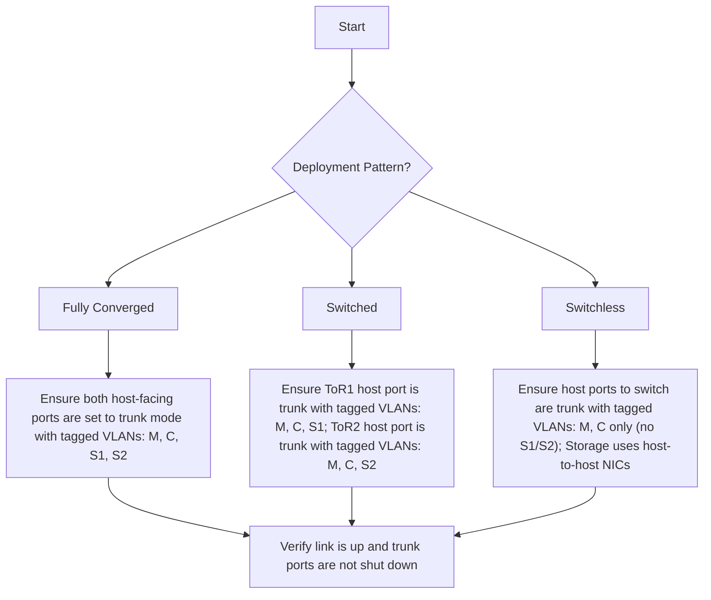
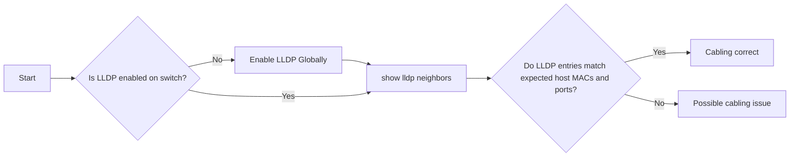
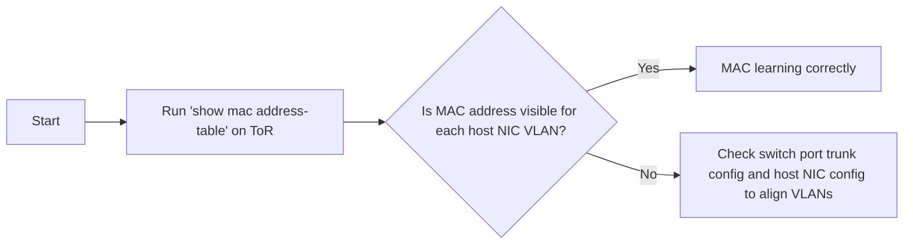

# Azure Local – Physical Network Connection Troubleshooting Guide

_A comprehensive troubleshooting guide covering systematic methodologies, diagnostic procedures, and resolution strategies for Azure Local physical network connectivity issues._

> [!IMPORTANT]
> **Document Purpose**: This troubleshooting guide provides diagnostic procedures for Azure Local physical network issues. Always refer to the latest official Microsoft documentation and support resources for the most current guidance.

---

## Overview

This troubleshooting guide provides step-by-step procedures to diagnose and resolve physical network connectivity issues in Azure Local deployments. It is designed for IT professionals, network engineers, and support technicians who need to quickly identify and fix network problems.

**Prerequisites:**
- Familiarity with Azure Local deployment patterns (Switchless, Switched, Fully Converged)
- Basic understanding of VLAN configuration and network switch management
- Access to both Azure Local hosts and ToR switches for diagnostic commands

**When to use this guide:**
- Network connectivity issues during or after Azure Local deployment
- RDMA performance problems or storage network failures
- Physical link failures or configuration mismatches
- VLAN configuration verification and MAC address learning issues

> [!TIP]
> For deployment pattern design guidance and hardware requirements, refer to the companion document: [Overview-Azure-Local-Deployment-Pattern](./Overview-Azure-Local-Deployment-Pattern.md).

---

## Table of Contents

- [Overview](#overview)
- [1. Network Troubleshooting Methodology](#1-network-troubleshooting-methodology)
  - [1.1 Deployment Pattern & Interface Configuration Verification](#11-deployment-pattern--interface-configuration-verification)
  - [1.2 Physical Connectivity Verification](#12-physical-connectivity-verification)  
  - [1.3 MAC Address Learning Verification](#13-mac-address-learning-verification)
  - [1.4 Advanced Troubleshooting](#14-advanced-troubleshooting)
- [2. Frequently Asked Questions](#2-frequently-asked-questions)
- [3. Additional Resources](#3-additional-resources)

---

## 1. Network Troubleshooting Methodology

This section provides systematic troubleshooting procedures for identifying and resolving common physical network issues in Azure Local environments. **Follow these procedures in sequence** for efficient problem isolation and resolution.

> [!IMPORTANT]
> **Sequential Approach**: Each troubleshooting step is designed to build upon the previous one. Complete each section fully before moving to the next to ensure accurate diagnosis.

### Troubleshooting Checklist Overview

Before diving into detailed procedures, use this quick checklist:

- [ ] **Step 1.1**: Verify deployment pattern and VLAN configuration
- [ ] **Step 1.2**: Confirm physical connectivity using LLDP
- [ ] **Step 1.3**: Validate MAC address learning on switches
- [ ] **Step 1.4**: Escalate to advanced troubleshooting if needed

### 1.1 Deployment Pattern & Interface Configuration Verification

**Purpose**: Verify that switch interfaces are correctly configured according to your Azure Local deployment pattern (Switchless, Switched, or Fully Converged).

**What this step validates**:
- Interface trunk mode configuration
- VLAN assignments match deployment pattern
- Physical interface status (up/down)

#### Troubleshooting Flowchart


#### Log Collection & Analysis

> [!NOTE]
> The following examples use Cisco NX-OS for reference. Please adjust the commands based on your switch vendor's CLI.

##### Interface Configuration Verification
- `show run interface <interface_name>`  
  - Verify the interface is configured in **trunk mode**
  - Confirm that required VLANs (M, C, S1, S2) are **allowed** based on the deployment pattern
  - Ensure the interface is **not shutdown** (`no shutdown`)


In this example, the Azure Local is deployed with **Switched** pattern, **7 is M, 201 is C, 711 is S1, and 712 is S2**. So the ToR1 and ToR2 Hosts-Facing ports should be configured as follows:

###### TOR1
``` console
TOR1# show run int ethernet 1/1

interface Ethernet1/1
  description Switched-Compute
  no cdp enable
  switchport
  switchport mode trunk
  switchport trunk native vlan 7
  switchport trunk allowed vlan 7,201
  spanning-tree port type edge trunk
  mtu 9216
  no logging event port link-status
  no shutdown

TOR1# show run int ethernet 1/21

interface Ethernet1/21
  description Switched-Storage
  no cdp enable
  switchport
  switchport mode trunk
  switchport trunk native vlan 99
  switchport trunk allowed vlan 711
  priority-flow-control mode on
  spanning-tree port type edge trunk
  mtu 9216
  no logging event port link-status
  service-policy type qos input AZS_SERVICES no-stats
  no shutdown

```
###### TOR2
``` console
TOR2# show run int ethernet 1/1

interface Ethernet1/1
  description Switched-Compute
  no cdp enable
  switchport
  switchport mode trunk
  switchport trunk native vlan 7
  switchport trunk allowed vlan 7,201
  spanning-tree port type edge trunk
  mtu 9216
  no logging event port link-status
  no shutdown

TOR2# show run int ethernet 1/21

interface Ethernet1/21
  description Switched-Storage
  no cdp enable
  switchport
  switchport mode trunk
  switchport trunk native vlan 99
  switchport trunk allowed vlan 712
  priority-flow-control mode on
  spanning-tree port type edge trunk
  mtu 9216
  no logging event port link-status
  service-policy type qos input AZS_SERVICES no-stats
  no shutdown
```

##### Interface Status Verification

- `show interface <interface_name>`  
  - Confirm the interface is **up and operational**
  - Check for absence of **errors**, or **drops**, especially **CRC errors**.


``` console
TOR1# show int ethernet 1/1
Ethernet1/1 is up
admin state is up, Dedicated Interface
  Hardware: 10000/25000/40000/50000/100000 Ethernet, address: 4874
.1039.e2e8 (bia 4874.1039.e2e8)
  Description: Switched-Compute
  MTU 9216 bytes, BW 100000000 Kbit , DLY 10 usec
  reliability 255/255, txload 1/255, rxload 1/255
  Encapsulation ARPA, medium is broadcast
  Port mode is trunk
  full-duplex, 100 Gb/s, media type is 100G
  Beacon is turned off
  Auto-Negotiation is turned on  FEC mode is Auto
  Input flow-control is off, output flow-control is off
  Auto-mdix is turned off
  Rate mode is dedicated
  Switchport monitor is off
  EtherType is 0x8100
  EEE (efficient-ethernet) : n/a
    admin fec state is auto, oper fec state is Rs-fec
  Last link flapped 1week(s) 1day(s)
  Last clearing of "show interface" counters never
  402 interface resets
  Load-Interval #1: 30 seconds
    30 seconds input rate 58976 bits/sec, 24 packets/sec
    30 seconds output rate 89304 bits/sec, 42 packets/sec
    input rate 58.98 Kbps, 24 pps; output rate 89.30 Kbps, 42 pps
  Load-Interval #2: 5 minute (300 seconds)
    300 seconds input rate 60440 bits/sec, 13 packets/sec
    300 seconds output rate 83152 bits/sec, 27 packets/sec
    input rate 60.44 Kbps, 13 pps; output rate 83.15 Kbps, 27 pps
  RX
    1803016069 unicast packets  1930412 multicast packets  84859 b
roadcast packets
    1805031341 input packets  1886271661338 bytes
    83702 jumbo packets  0 storm suppression bytes
    0 runts  0 giants  0 CRC  0 no buffer
    0 input error  0 short frame  0 overrun   0 underrun  0 ignore
d
    0 watchdog  0 bad etype drop  0 bad proto drop  0 if down drop
    0 input with dribble  0 input discard
    0 Rx pause
    0 Stomped CRC
  TX
    2459465706 unicast packets  389073841 multicast packets  65260
69 broadcast packets
    2855065616 output packets  3119994074289 bytes
    72934 jumbo packets
    0 output error  0 collision  0 deferred  0 late collision
    0 lost carrier  0 no carrier  0 babble  0 output discard
    0 Tx pause

```

### 1.2 Physical Connectivity Verification

**Purpose**: Confirm physical cable connections between Azure Local hosts and ToR switches using LLDP (Link Layer Discovery Protocol).

**What this step validates**:
- Physical cable connections are correct
- LLDP discovery between hosts and switches
- Port-to-port mapping accuracy

#### Troubleshooting Flowchart


##### Log Collection & Analysis
- `show lldp neighbors`  
  - Verify LLDP entries match expected host MAC addresses and ports
  - Check for any discrepancies in neighbor information

###### On Azure Local Host
``` console
[Host1]: PS C:\Users\Administrator\Documents> Get-NetAdapter | select Name,MacAddress,Status

Name                                 MacAddress        Status
----                                 ----------        ------
ethernet 2                           C8-4B-D6-90-C7-E6 Up
ethernet 4                           C8-4B-D6-90-C7-E8 Up
ethernet                             C8-4B-D6-90-C7-E5 Up
ethernet 3                           C8-4B-D6-90-C7-E7 Up

```

###### On ToR Switch

``` console
# on TOR1
TOR1# show lldp neighbors
Capability codes:
  (R) Router, (B) Bridge, (T) Telephone, (C) DOCSIS Cable Device
  (W) WLAN Access Point, (P) Repeater, (S) Station, (O) Other
Device ID            Local Intf      Hold-time  Capability  Port ID
c84b.d690.c7e5       Eth1/1          30                     c84b.d690.c7e5
...
c84b.d690.c7e7       Eth1/21         30                     c84b.d690.c7e7
...

# on TOR2
TOR2# show lldp neighbors
Capability codes:
  (R) Router, (B) Bridge, (T) Telephone, (C) DOCSIS Cable Device
  (W) WLAN Access Point, (P) Repeater, (S) Station, (O) Other
Device ID            Local Intf      Hold-time  Capability  Port ID
c84b.d690.c7e6       Eth1/1          30                     c84b.d690.c7e6
...
c84b.d690.c7e8       Eth1/21         30                     c84b.d690.c7e8
...
```

So the cable mapping based on the lldp neighbors output is as follows:

| Host Name | NIC Name     | MAC Address           | Connected ToR | ToR Interface     |
|-----------|--------------|------------------------|---------------|-------------------|
| Host1     | Ethernet     | C8-4B-D6-90-C7-E5      | ToR1          | Ethernet1/1     |
| Host1     | Ethernet 2   | C8-4B-D6-90-C7-E6      | ToR2          | Ethernet1/1   |
| Host1     | Ethernet 3   | C8-4B-D6-90-C7-E7      | ToR1          | Ethernet1/21    |
| Host1     | Ethernet 4   | C8-4B-D6-90-C7-E8      | ToR2          | Ethernet1/21   |


---

### 1.3 MAC Address Learning Verification

**Purpose**: Ensure switches are learning MAC addresses correctly for each host NIC on the appropriate VLANs.

**What this step validates**:
- MAC address population in switch tables
- VLAN-to-MAC address mapping
- Layer 2 forwarding table accuracy

Switches learn which MAC addresses are connected to which ports and VLANs. If a switch doesn't learn the correct MAC for a host's NICs, traffic won't reach the intended host. This step ensures each host is properly connected and the network knows where to send traffic.

#### Troubleshooting Flowchart



##### Log Collection & Analysis
- `show mac address-table`  
  - Verify that the MAC addresses of each host NIC are learned on the expected VLANs
  - Check for any missing or incorrect entries

###### On Azure Local Host
``` Powershell
[Host1]: PS C:\Users\Administrator\Documents> Get-NetAdapter | ft InterfaceAlias, VlanID, MacAddress
 
InterfaceAlias VlanID MacAddress
-------------- ------ ----------
ethernet 4        712 C8-4B-D6-90-C7-E8
ethernet 3        711 C8-4B-D6-90-C7-E7
ethernet 2        0   C8-4B-D6-90-C7-E6
ethernet          0   C8-4B-D6-90-C7-E5

```

###### On ToR Switch
``` console
# On TOR1
TOR1# show mac address-table interface ethernet 1/1
Legend:
        * - primary entry, G - Gateway MAC, (R) - Routed MAC, O - Overlay MAC
        age - seconds since last seen,+ - primary entry using vPC Peer-Link,
        (T) - True, (F) - False, C - ControlPlane MAC, ~ - vsan
   VLAN     MAC Address      Type      age     Secure NTFY Ports
---------+-----------------+--------+---------+------+----+------------------
*    7     cb4b.d690.c7e5   dynamic  0         F      F    Eth1/1

TOR1# show mac address-table interface ethernet 1/21
Legend:
        * - primary entry, G - Gateway MAC, (R) - Routed MAC, O - Overlay MAC
        age - seconds since last seen,+ - primary entry using vPC Peer-Link,
        (T) - True, (F) - False, C - ControlPlane MAC, ~ - vsan
   VLAN     MAC Address      Type      age     Secure NTFY Ports
---------+-----------------+--------+---------+------+----+------------------
*  711     cb4b.d690.c7e7   dynamic  0         F      F    Eth1/21


# On TOR2
TOR2# show mac address-table interface ethernet 1/1
Legend:
        * - primary entry, G - Gateway MAC, (R) - Routed MAC, O - Overlay MAC
        age - seconds since last seen,+ - primary entry using vPC Peer-Link,
        (T) - True, (F) - False, C - ControlPlane MAC, ~ - vsan
   VLAN     MAC Address      Type      age     Secure NTFY Ports
---------+-----------------+--------+---------+------+----+------------------
*    7     cb4b.d690.c7e6   dynamic  0         F      F    Eth1/1

TOR2# show mac address-table interface ethernet 1/21
Legend:
        * - primary entry, G - Gateway MAC, (R) - Routed MAC, O - Overlay MAC
        age - seconds since last seen,+ - primary entry using vPC Peer-Link,
        (T) - True, (F) - False, C - ControlPlane MAC, ~ - vsan
   VLAN     MAC Address      Type      age     Secure NTFY Ports
---------+-----------------+--------+---------+------+----+------------------
*  712     cb4b.d690.c7e8   dynamic  0         F      F    Eth1/21
```

### 1.4 Advanced Troubleshooting

**Purpose**: Reference advanced troubleshooting resources for complex networking scenarios beyond basic physical connectivity.

**When to use**: After completing steps 1.1-1.3 and basic connectivity is confirmed, but performance or advanced configuration issues persist.

This document covers fundamental physical network troubleshooting procedures. For advanced networking topics including RDMA optimization, latency tuning, Software Defined Networking (SDN) configuration, BGP routing, MLAG implementation, and Spanning Tree Protocol troubleshooting, please refer to the dedicated technical documentation available in the Azure Local documentation library.

## 2. Frequently Asked Questions

### Q: How can I verify that VLANs are properly configured for my deployment pattern?

**A:**
Use the following verification matrix based on your deployment pattern:

**Switchless Deployment:**
- Host-facing switch ports: Trunk mode with Management (M) and Compute (C) VLANs only
- No Storage VLANs should be configured on ToR switches
- Verify direct host-to-host storage connections are functioning

**Switched Deployment:**
- ToR1 host ports: Trunk mode with M, C, and S1 VLANs
- ToR2 host ports: Trunk mode with M, C, and S2 VLANs  
- Storage VLANs should NOT be allowed on the peer link between ToRs

**Fully Converged Deployment:**
- Both ToR host ports: Trunk mode with M, C, S1, and S2 VLANs (Baseline)
- Storage VLANs may need to be allowed on peer link depending on configuration choice

### Q: Why am I seeing CRC errors or packet drops on storage interfaces?

**A:**
CRC errors and packet drops on storage interfaces typically indicate:

1. **Physical Issues:**
   - Faulty cables or transceivers
   - Poor cable connections
   - Electromagnetic interference

2. **Configuration Issues:**
   - Missing or incorrect DCB (PFC/ETS) configuration
   - MTU mismatches between host and switch
   - Incorrect RDMA settings

**Resolution Steps:**
1. Check physical connections and replace cables if necessary
2. Verify DCB configuration on storage interfaces
3. Ensure MTU is consistently configured (typically 9000+ bytes)
4. Review RDMA adapter settings on Azure Local hosts

### Q: How do I troubleshoot missing MAC addresses in the switch's MAC address table?

**A:**
Missing MAC addresses usually indicate Layer 2 connectivity or VLAN configuration issues:

1. **Verify VLAN Configuration:**
   - Ensure host NICs are configured with correct VLAN tags
   - Confirm switch ports allow the required VLANs in trunk mode

2. **Check Interface Status:**
   - Verify both host NIC and switch port are up and operational
   - Look for link flapping or negotiation issues

3. **Generate Traffic:**
   ```powershell
   # On Azure Local host - generate traffic to populate MAC table
   Test-NetConnection -ComputerName <target-host> -Port 445
   ```

4. **Verify Switch Port Configuration:**
   ```console
   # Check if port is in correct mode and VLANs are allowed
   show interface ethernet 1/1 switchport
   show interface ethernet 1/1 trunk
   ```

### Q: Why can't I see storage IP addresses in the ARP table, while Management and Compute IPs are visible?

**A:**
This is **expected behavior** in Azure Local deployments and not an issue that requires troubleshooting.

**Explanation:**
- **Storage VLANs** are typically configured as **Layer 2 (L2) networks** without IP subnets
- Storage traffic is **VLAN-tagged and handled entirely at Layer 2**
- No IP-based communication or ARP resolution occurs for storage traffic
- **Management and Compute VLANs** are **Layer 3 networks** with IP addresses, which is why their entries appear in the ARP table

This design is intentional and optimizes storage performance by eliminating unnecessary Layer 3 overhead.


## 3. Additional Resources

For comprehensive Azure Local networking guidance, refer to these official Microsoft documentation resources:

### Official Documentation
- **[Physical network requirements for Azure Local](https://learn.microsoft.com/en-us/azure/azure-local/concepts/physical-network-requirements)**  
  Complete hardware and configuration requirements for Azure Local network infrastructure

- **[Host network requirements for Azure Local](https://learn.microsoft.com/en-us/azure/azure-local/concepts/host-network-requirements)**  
  Detailed guidance for host-level networking configuration and requirements

- **[Software Defined Networking (SDN) in Azure Local](https://learn.microsoft.com/en-us/azure/azure-local/concepts/software-defined-networking-23h2)**  
  Comprehensive guide to SDN implementation and configuration in Azure Local environments
