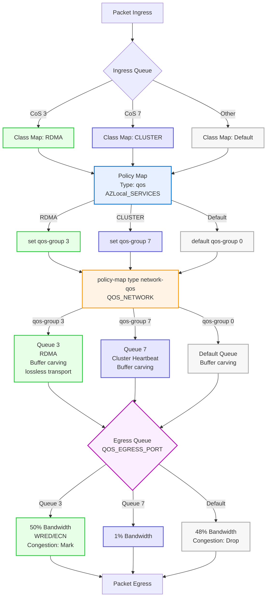

# QoS Policy

Below is an example Cisco Nexus QoS configuration for an Azure Local environment. This policy ensures that storage (RDMA) and cluster heartbeat traffic are prioritized and protected from congestion, while enabling efficient bandwidth sharing for other traffic classes. The configuration includes traffic class definitions, bandwidth guarantees, congestion management, and MTU settings. The QoS policy should be applied to interfaces carrying storage intent traffic.

## Requirements

1. Support three CoS values will be utilized within the Azure Local environment, default values are as follows:
   - CoS 3: Storage, also refered to as RDMA.
   - CoS 7: Cluster Heartbeat
   - CoS 0: Default traffic
2. Support Storage and Cluster heatbeat traffic with Priority Flow Control (802.1Qbb)
   - Establish Storage as a no-drop traffic class.
   - Cluster heartbeat traffic will have the highest Priority to protect protect against packet loss.
   - Default traffic is the lowest prioirty, in the event of congestion.  Default will be dropped to protect Storage and Cluster.
3. Bandwidth Reservations utilizing ETS (802.1Qaz)
   - Storage assigned a minimum 50% of the interface bandwidth.
   - Cluster assigned a minimum 1 - 2% of the interface bandwidth.  The percentage is based on the Interface speed
     - 10G: 2%
     - 25G or Greater: 1%
4. Congestion Notification
   - Support for Explicit Congestion Notification (ECN) with Storage traffic.

## In Scope network patterns

This QoS policy is applicable to the following Azure Local deployment models:

- **Fully hyperconverged:** Compute, management, and storage traffic all share the same network interface.
- **Disaggregated:** Compute and management traffic are assigned to dedicated interfaces, while storage traffic is isolated on its own separate interface.
- **Rack Aware Clsuter:** Based on Disaggreated design with room to room to storage links.
  - [Disaggregated Design](./Disaggregated_Switched_Storage.md)

## Out of Scope network patterns

Switchless configurations do not require a switch QoS policy, as the switch is not used to transport storage traffic. In these scenarios, storage traffic is handled directly between endpoints without traversing a network switch, making switch-based QoS settings unnecessary.

## QOS Policy Overview



## ClassMap

```console
class-map type qos match-all RDMA
  match cos 3
class-map type qos match-all CLUSTER
  match cos 7
```

ClassMap identification is performed by matching the packet's CoS (Class of Service) value. If the CoS value is 3 (for RDMA/Storage) or 7 (for Cluster Heartbeat), the traffic is classified into the corresponding class. All other traffic is automatically assigned to the implicit default class. Matching solely on CoS ensures accurate classification and prevents critical traffic from being misclassified as default. This approach simplifies policy management.

## Policy Map (QoS)

```console
policy-map type qos AZLocal_SERVICES
  class RDMA
    set qos-group 3
  class CLUSTER
    set qos-group 7
```

This policy map assigns classified traffic to internal QoS groups. All other traffic classes not represented are placed in an implicit default class (qos-group 0).

## Policy Map (Network QoS)

```console
policy-map type network-qos QOS_NETWORK
  class type network-qos c-8q-nq3
    mtu 9216
    pause pfc-cos 3
  class type network-qos c-8q-nq-default
    mtu 9216
  class type network-qos c-8q-nq7
    mtu 9216
```

This policy map sets global Layer 2 properties for each traffic class by configuring the MTU and enabling Priority Flow Control (PFC) for storage traffic (CoS 3). The `pause pfc-cos 3` command activates PFC on CoS 3, ensuring lossless transport for RDMA and storage traffic. On Cisco NX-OS, this command alone is sufficient to achieve lossless behavior for the specified class, and the `no-drop` keyword is optional and can be added for clarity if needed. The `mtu 9216` command applies a consistent jumbo frame size to all classes, which is recommended for uniformity and optimal support of high-throughput workloads. On Cisco Nexus switches, setting the MTU to 9216 also initiates buffer carving for the ingress queue, which helps optimize buffer allocation for demanding, low-latency applications. Buffer management and MTU configuration may vary on other switch platforms, so it is important to review vendor documentation for platform-specific recommendations.

## Policy Map (Queuing)

```console
policy-map type queuing QOS_EGRESS_PORT
  class type queuing c-out-8q-q3
    bandwidth remaining percent 50
    random-detect minimum-threshold 300 kbytes maximum-threshold 300 kbytes drop-probability 100 weight 0 ecn
  class type queuing c-out-8q-q-default
    bandwidth remaining percent 48
  class type queuing c-out-8q-q7
    bandwidth percent 1
  class type queuing c-out-8q-q1
    bandwidth remaining percent 0
  class type queuing c-out-8q-q2
    bandwidth remaining percent 0
  class type queuing c-out-8q-q4
    bandwidth remaining percent 0
  class type queuing c-out-8q-q5
    bandwidth remaining percent 0
  class type queuing c-out-8q-q6
    bandwidth remaining percent 0
```

- Only queues 3, 7, and default are actively used in this policy. All other queues are configured with 0% bandwidth and remain unused.
- Bandwidth reservations are explicitly configured for queues 3 and 7. Queue 3 (RDMA) is guaranteed a minimum of 50% of the interface bandwidth and can use up to 98% if available. When congestion occurs, tail drop is performed and default traffic may be randomly dropped as needed. Queue 7 (Cluster Heartbeat) is reserved 1% of bandwidth for 25G interfaces and 2% for 10G interfaces. This ensures reliable delivery of critical heartbeat traffic.
- The `random-detect ... ecn` command enables [Explicit Congestion Notification (ECN)](ecn.md) marking for congestion management in queue 3 (RDMA traffic). When congestion is detected, the switch marks packets instead of dropping them, which improves performance for lossless traffic.
- The `random-detect minimum-threshold 300 kbytes maximum-threshold 300 kbytes drop-probability 100 weight 0` configuration sets the minimum and maximum queue thresholds for WRED (Weighted Random Early Detection). When the queue depth reaches 300 kbytes, packets are marked or dropped with a probability of 100%. The weight parameter influences how quickly the average queue size responds to changes in traffic, with a lower value making the response immediate.  RDMA traffic can spike in micro second bursts and having the immediate response ensure the best protection of the lossless traffic.
- Because class 3 (RDMA) is configured as lossless, the switch will not drop packets from this class during congestion. Instead, when the interface is congested, packets from the default class will be dropped to maintain lossless delivery for class 3 traffic.

**Summary Table:**

| Traffic Type      | CoS | Bandwidth Guarantee | Features Enabled | MTU  | Notes                                  |
| ----------------- | --- | ------------------- | ---------------- | ---- | -------------------------------------- |
| RDMA (Storage)    | 3   | minimum 50%         | PFC, ECN/WRED    | 9216 | Lossless, congestion-aware             |
| Cluster Heartbeat | 7   | 1% (or 2% for 10G)  | Dedicated Queue  | 9216 | Strict minimum for reliability         |
| Default/Other     | -   | Remaining (48%)     | -                | 9216 | Shared among all other traffic classes |

This policy ensures that storage and cluster heartbeat traffic are always prioritized, minimizing latency and packet loss, while still allowing efficient use of available bandwidth for other traffic types.

```console
policy-map type network-qos QOS_NETWORK
  class type network-qos c-8q-nq3
    mtu 9216
    pause pfc-cos 3
  class type network-qos c-8q-nq-default
    mtu 9216
  class type network-qos c-8q-nq7
    mtu 9216
!
class-map type qos match-all RDMA
  match cos 3
class-map type qos match-all CLUSTER
  match cos 7
!
policy-map type qos AZS_SERVICES
  class RDMA
    set qos-group 3
  class CLUSTER
    set qos-group 7
!
policy-map type queuing QOS_EGRESS_PORT
  class type queuing c-out-8q-q3
    bandwidth remaining percent 50
    random-detect minimum-threshold 300 kbytes maximum-threshold 300 kbytes drop-probability 100 weight 0 ecn
  class type queuing c-out-8q-q-default
    bandwidth remaining percent 48
  class type queuing c-out-8q-q7
    bandwidth percent 1
  class type queuing c-out-8q-q1
    bandwidth remaining percent 0
  class type queuing c-out-8q-q2
    bandwidth remaining percent 0
  class type queuing c-out-8q-q4
    bandwidth remaining percent 0
  class type queuing c-out-8q-q5
    bandwidth remaining percent 0
  class type queuing c-out-8q-q6
    bandwidth remaining percent 0
```

## System QoS Application

```console
system qos
  service-policy type queuing output QOS_EGRESS_PORT
  service-policy type network-qos QOS_NETWORK
```

This applies the defined queuing and network QoS policies globally to all interfaces.

## Reference

- [Azure Local Network Requirements][AzureLocalPhysicalNetworkRequirements]
- [Azure Local Network Considerations for Cloud Deployment of Azure Local][AzureLocalNetworkConsiderationForCloudDeploymentOfAzureLocal]
- [Cisco Azure Local Whitepaper][CiscoNexus9000NXOSACI]
- [RoCE Storage Implementation over NX-OS VXLAN Fabrics][ROCEStorageNXOSVXLANFabric]
- [Cisco Nexus 9000 Series NX-OS Quality of Service Configuration Guide, Release 10.5(x)][CiscoNexusNetworkQOS]
- [Cisco Nexus Configure Queuing and Scheduling][CiscoNexusQueuingAndScheduling]
- [Cisco WRED-Explicit Congestion Notification][CiscoWredECN]
- [RFC 3168 - The Addition of Explicit Congestion Notification (ECN) to IP][rfc3168]

[AzureLocalPhysicalNetworkRequirements]: https://learn.microsoft.com/en-us/azure/azure-local/concepts/physical-network-requirements
[AzureLocalNetworkConsiderationForCloudDeploymentOfAzureLocal]: https://learn.microsoft.com/en-us/azure/azure-local/plan/cloud-deployment-network-considerations "This article discusses how to design and plan an Azure Local system network for cloud deployment. Before you continue, familiarize yourself with the various Azure Local networking patterns and available configurations."
[ROCEStorageNXOSVXLANFabric]: https://www.cisco.com/c/en/us/td/docs/dcn/whitepapers/roce-storage-implementation-over-nxos-vxlan-fabrics.html
[CiscoNexus9000NXOSACI]: https://www.cisco.com/c/en/us/td/docs/dcn/whitepapers/ACI_AzureLocal_whitepaper.html
[CiscoNexusNetworkQOS]: https://www.cisco.com/c/en/us/td/docs/dcn/nx-os/nexus9000/105x/configuration/qos/cisco-nexus-9000-series-nx-os-quality-of-service-configuration-guide-105x/m-configuring-network-qos.html "Configuration guide: The network QoS policy defines the characteristics of QoS properties network wide."
[CiscoNexusQueuingAndScheduling]: https://www.cisco.com/c/en/us/td/docs/dcn/nx-os/nexus9000/105x/configuration/qos/cisco-nexus-9000-series-nx-os-quality-of-service-configuration-guide-105x/m-configuring-queuing-and-scheduling.html#task_4FB1415CDE92466FB347121D96D6D8C2
[CiscoWredECN]: https://www.cisco.com/c/en/us/td/docs/ios-xml/ios/qos_conavd/configuration/15-mt/qos-conavd-15-mt-book/qos-conavd-wred-ecn.html "WRED drops packets, based on the average queue length exceeding a specific threshold value, to indicate congestion. ECN is an extension to WRED in that ECN marks packets instead of dropping them when the average queue length exceeds a specific threshold value. When configured with the WRED -- Explicit Congestion Notification feature, routers and end hosts would use this marking as a signal that the network is congested and slow down sending packets."
[rfc3168]: https://www.rfc-editor.org/rfc/rfc3168 "We begin by describing TCP's use of packet drops as an indication of congestion.  Next we explain that with the addition of active queue management (e.g., RED) to the Internet infrastructure, where routers detect congestion before the queue overflows, routers are no longer limited to packet drops as an indication of congestion.  Routers can instead set the Congestion Experienced (CE) codepoint in the IP header of packets from ECN-capable transports.  We describe when the CE codepoint is to be set in routers, and describe modifications needed to TCP to make it ECN-capable.  Modifications to other transport protocols (e.g., unreliable unicast or multicast, reliable multicast, other reliable unicast transport protocols) could be considered as those protocols are developed and advance through the standards process.  We also describe in this document the issues involving the use of ECN within IP tunnels, and within IPsec tunnels in particular."
