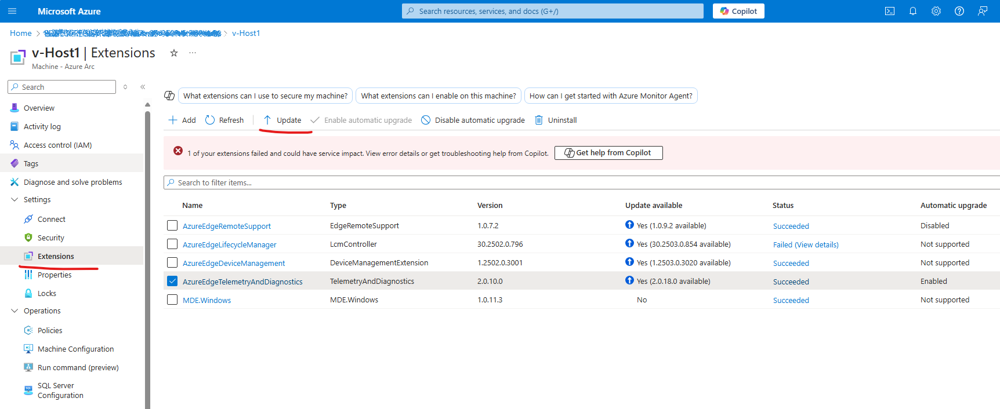

# TSG | Upgrading the TelemetryAndDiagnostics ARC Extension to Version 2.0.16.0 or Later

If the TelemetryAndDiagnostics ARC extension on your AzureLocal machine is less than 2.0.16.0, it must be upgraded to the latest version. It is recommended to do so through the Azure Portal.


However, if upgrading through the Portal fails, it may be necessary to upgrade the extension via manual intervention on the machine itself. This TSG outlines the steps to do so.

## Symptoms

The TelemetryAndDiagnostics ARC extension version can be found by navigating to the following path. There will be a folder for the extension version. If there are multiple folders in this location, the current version is the highest one.
```PowerShell
Get-ChildItem "C:\Packages\Plugins\Microsoft.AzureStack.Observability.TelemetryAndDiagnostics"
<#
Example output
    Directory: C:\Packages\Plugins\Microsoft.AzureStack.Observability.TelemetryAndDiagnostics
Mode                 LastWriteTime         Length Name
----                 -------------         ------ ----
d-----         2/14/2025   2:02 AM                2.0.10.0

**This indicates the version installed on the machine is 2.0.10.0**
#>
```
If the version is less than 2.0.16.0, then proceed with the following steps to upgrade to the latest extension version.

## Upgrade Steps
1.  Run the following commands. The output is necessary to supply variables to Connect-AzAccount
```PowerShell
    $arcInfo = & azcmagent show -j | ConvertFrom-Json
    $rgName = $arcInfo.resourceGroup
    $subscriptionId = $arcInfo.subscriptionId
    $tenantId = $arcInfo.TenantId
    $region = $arcInfo.location
```

2.  Connect to Azure. For example, if using Device authentication, the command would be:

```PowerShell
    Connect-AzAccount -UseDeviceAuthentication -SubscriptionId $subscriptionId -TenantId $tenantId
```    

3.  To get the newest extension version, we will remove the old extension and install the new one directly.
<font color='red'>**If the below commands fail**, proceed to the [Troubleshooting section](#troubleshooting).</font>
```PowerShell
    Remove-AzConnectedMachineExtension -ResourceGroupName $rgName -MachineName $env:COMPUTERNAME -Name "AzureEdgeTelemetryAndDiagnostics"
    New-AzConnectedMachineExtension `
        -Name "AzureEdgeTelemetryAndDiagnostics" `
        -ResourceGroupName $rgName `
        -SubscriptionId $subscriptionId `
        -MachineName $($env:COMPUTERNAME) `
        -Location $region `
        -Publisher "Microsoft.AzureStack.Observability" `
        -ExtensionType "TelemetryAndDiagnostics" `
        -NoWait

```    

4.  To verify that the new version of the extension has been installed, run the following command. If the installation was successful, the output of the below command should show TypeHandlerVersion as 2.0.16.0 or greater, and ProvisioningState as Succeeded.

```PowerShell
    Get-AzConnectedMachineExtension -ResourceGroupName $rgName -SubscriptionId $subscriptionId -MachineName $($env:COMPUTERNAME) -Name "AzureEdgeTelemetryAndDiagnostics"

<#
Expected Output
MachineName                    : <computer name>
AutoUpgradeMinorVersion        : False
EnableAutomaticUpgrade         : True
ForceUpdateTag                 :
Id                             : <resource id>
InstanceViewName               : AzureEdgeTelemetryAndDiagnostics
InstanceViewType               : TelemetryAndDiagnostics
InstanceViewTypeHandlerVersion : 2.0.16.0
Location                       : <region>
MachineExtensionType           : TelemetryAndDiagnostics
Name                           : AzureEdgeTelemetryAndDiagnostics
ProtectedSetting               : {
                                 }
ProvisioningState              : Succeeded
Publisher                      : Microsoft.AzureStack.Observability
ResourceGroupName              : <resource group name>
Setting                        : {
                                 }
StatusCode                     : 0
StatusDisplayStatus            :
StatusLevel                    : Information
StatusMessage                  : Extension Message: Successfully enabled extension.
StatusTime                     :
SystemDataCreatedAt            :
SystemDataCreatedBy            :
SystemDataCreatedByType        :
SystemDataLastModifiedAt       :
SystemDataLastModifiedBy       :
SystemDataLastModifiedByType   :
Tags                           : {
                                 }
Type                           : Microsoft.HybridCompute/machines/extensions
TypeHandlerVersion             : 2.0.16.0
#>
```

## Troubleshooting
<font color='red'>**Follow this section only if Step 3 of [Upgrade Steps](#upgrade-steps) fails.**</font>
The Remove-AzConnectedMachineExtension command to delete the extension may fail with errors like:
```PowerShell
Extension failed to delete. Uninstall command failed with exit code: 1 Error message:
std error:  Std out:  std out:
Delete of extension failed with error: boost::filesystem::remove_all:
The request is not supported [system:50]: "<folder path>"  Extension exit code: 62
```
or
```PowerShell
The process cannot access the file '<filepath>' because it is being used by another process.
```
or
```PowerShell
Delete of extension failed with error: boost::filesystem::remove_all: 
The process cannot access the file because it is being used by another process [system:32]: <filepath>
```

### Cause
This issue is caused by lingering process handles on the folders or binaries of the older extension version, which lead to uninstallation failure and subsequently block the extension upgrade. 

### Mitigation Details
In order to mitigate this issue, we must close these lingering process handles and manually trigger extension upgrade. 
**The most straightforward way to do so is to reboot the node. If that is doable, then after rebooting, Redo the [Upgrade Steps](#upgrade-steps) starting from Step 1.** However, for scenarios where the node **cannot** be rebooted, proceed through following mitigation steps.
1. Create a new file somewhere on the node.
```Powershell
New-Item "Close-ProcessHandles.ps1"
```
2. Copy the contents of the code block in **[this file](./Close-ProcessHandles.md)** into the file you created.
3. Unblock Close-ProcessHandles.ps1 (we need to run this command because the script is not signed):
```PowerShell
Unblock-File -Path ".\Close-ProcessHandles.ps1"
```
4. Execute the file. If the TelemetryAndDiagnostics extension version is 2.0.0.0 or greater, then the path to the Observability NuGet store to clean must be specified. You can see the extension version either in the Azure Portal or by the version folder name at:

```
C:\Packages\Plugins\Microsoft.AzureStack.Observability.TelemetryAndDiagnostics\<extension version>
```
### If extension version is less than 2.0.0.0
```PowerShell
.\Close-ProcessHandles.ps1
```
### If extension version is 2.0.0.0 or greater
```PowerShell
$obsNugetStoreLocation = (Get-ChildItem "C:\Obs_*").Name
.\Close-ProcessHandles.ps1 -FolderPathToClean "C:\$obsNugetStoreLocation\Nugets\<extension version>"
```
  
The output of the script execution will include the path of a transcript file generated by the script execution. Save this transcript file in case it is needed for further triage.

**Note:** On some machines, copying a script to the node is not allowed. In that case, copy and paste the contents of the script into the PS session and execute it line by line.

5. After the script's successful execution, close any PowerShell sessions used to execute steps in this troubleshooting guide. Open a new one and redo the [Upgrade Steps](#upgrade-steps) starting from step 1.

