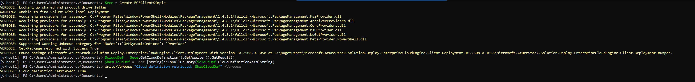

# ECE Failed to acquire the read lock within 00:01:00

# Description

## Issue Validation

  

This tsg applies to updates from builds lower than 2508 but the most common is builds lower than 2506

  

## Symptoms

  

The main symptom seen is an update failure that contains the error message **"Failed to acquire the read lock within 00:01:00"**. An example of the full error message can be seen below. This error can also be seen on some ECE client calls manually made. The same mitigation can be applied in any case where this error is seen

  

```

Microsoft.AzureStack.Solution.Deploy.EnterpriseCloudEngine.ActionPlanExecutionEngine.Contract.ServiceNotReadyException: Failed to acquire the read lock within 00:01:00.

   at Microsoft.AzureStack.Solution.Deploy.EnterpriseCloudEngine.Core.CloudDefinitionGenerator.<GenerateOrWaitForCacheValue>d__16.MoveNext()

--- End of stack trace from previous location where exception was thrown ---

   at System.Runtime.ExceptionServices.ExceptionDispatchInfo.Throw()

   at System.Runtime.CompilerServices.TaskAwaiter.HandleNonSuccessAndDebuggerNotification(Task task)

   at Microsoft.AzureStack.Solution.Deploy.EnterpriseCloudEngine.Core.CloudDefinitionGenerator.<GetValueAsync>d__15.MoveNext()

--- End of stack trace from previous location where exception was thrown ---

   at System.Runtime.ExceptionServices.ExceptionDispatchInfo.Throw()

   at System.Runtime.CompilerServices.TaskAwaiter.HandleNonSuccessAndDebuggerNotification(Task task)

   at Microsoft.AzureStack.Solution.Deploy.EnterpriseCloudEngine.Core.ECEReliableStore.<>c__DisplayClass14_0`1.<<LoadAsync>b__0>d.MoveNext()

--- End of stack trace from previous location where exception was thrown ---

   at System.Runtime.ExceptionServices.ExceptionDispatchInfo.Throw()

   at System.Runtime.CompilerServices.TaskAwaiter.HandleNonSuccessAndDebuggerNotification(Task task)

   at System.Runtime.CompilerServices.TaskAwaiter.GetResult()

   at Microsoft.AzureStack.Common.Infrastructure.ReliableCollections.EntityStore.TransactionRetryHandler.<>c__DisplayClass10_0.<<RetryTransactionOnTransientErrors>b__0>d.MoveNext()

--- End of stack trace from previous location where exception was thrown ---

   at System.Runtime.ExceptionServices.ExceptionDispatchInfo.Throw()

   at System.Runtime.CompilerServices.TaskAwaiter.HandleNonSuccessAndDebuggerNotification(Task task)

   at System.Runtime.CompilerServices.TaskAwaiter`1.GetResult()

   at Microsoft.AzureStack.Common.Infrastructure.ReliableCollections.EntityStore.TransactionRetryHandler.<RetryTransactionOnTransientErrors>d__12`1.MoveNext()

--- End of stack trace from previous location where exception was thrown ---

   at System.Runtime.ExceptionServices.ExceptionDispatchInfo.Throw()

   at System.Runtime.CompilerServices.TaskAwaiter.HandleNonSuccessAndDebuggerNotification(Task task)

   at Microsoft.AzureStack.Solution.Deploy.EnterpriseCloudEngine.Core.ECEReliableStore.<LoadAsync>d__14`1.MoveNext()

--- End of stack trace from previous location where exception was thrown ---

   at System.Runtime.ExceptionServices.ExceptionDispatchInfo.Throw()

   at System.Runtime.CompilerServices.TaskAwaiter.HandleNonSuccessAndDebuggerNotification(Task task)

   at Microsoft.AzureStack.Solution.Deploy.EnterpriseCloudEngine.Core.ECEReliableStore.Load[T](ItemName itemName)

   at CloudEngine.Actions.ActionTask.Invoke(Configuration roleConfiguration, String startStep, String endStep, String[] skip, Nullable`1 retries, Nullable`1 interfaceTimeout, CancellationToken cancellationToken, Dictionary`2 runtimeParameter, Boolean runInProcess, String storeName, String storeRoot)

  

```

## Cause
This is a transient issue where ECE receives too many configuration requests. ECE will eventually clean the queued requests and become healthy again. It can also be manually mitigated by forcing ECE to failover to a new node which will clear the queue of requests and allow an uncontested configuration generation. After applying the mitigation and running the command to ensure ECE is in a good state, the action that originally failed should be retried.


## Mitigation Details
  

1) Run the below command on any host to fail over ECE. It may take up to 5 mins for this command to complete. Wait for this command to return before proceeding to the next step.

    ```

    Get-ClusterGroup | where Name -eq 'Azure Stack HCI Orchestrator Service Cluster Group' | Move-ClusterGroup

    ```

  

2) Run the command to check ECE was able to generate a configuration. The command below should complete within 1 minute without error

  

    ```

    $ece = Create-ECEClientSimple

    $cloudDef = $ece.GetCloudDefinition().GetAwaiter().GetResult()

    $hasCloudDef = -not [string]::IsNullOrEmpty($cloudDef.CloudDefinitionAsXmlString)

    Write-Verbose "Cloud definition retrieved: $hasCloudDef" -Verbose

    ```

    Example Output:


  

3) If step 2 prints "Cloud definition retrieved: True", then resume the operation that previously failed.