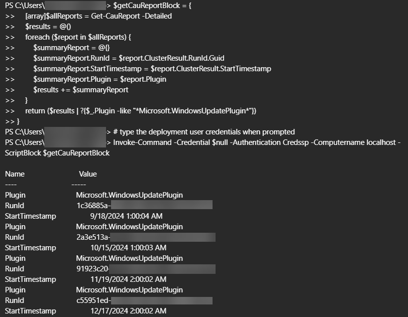
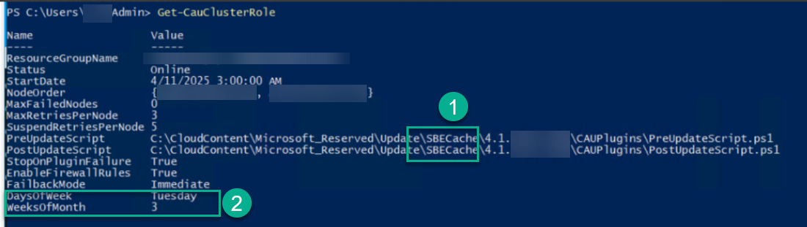
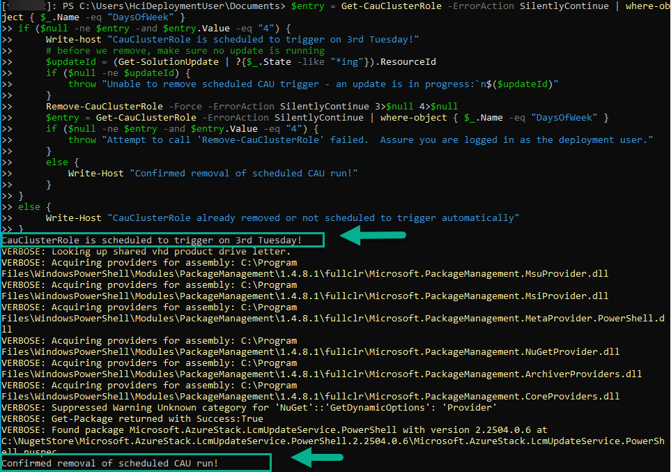
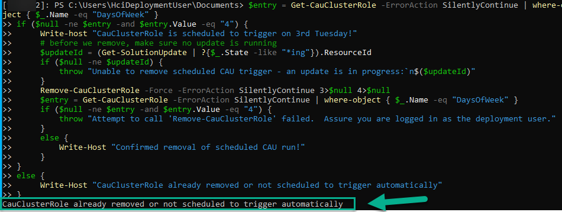
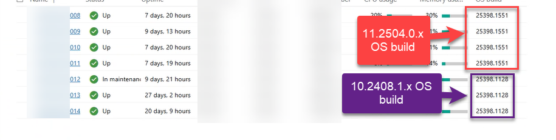

**Requires action before 3rd Tuesday of month (e.g. dates in 2025: May 20th, June 17th, July 15th)**

This issue can be seen on any Azure Local build prior to 2505.

Depending on the hardware vendor, the latest OS updates (the monthly recommended cumulative update) may install automatically on the 3rd Tuesday of the month if for some hardware models of servers IF the most recently installed update included a [Solution Builder Extension (SBE)](https://learn.microsoft.com/en-us/azure/azure-local/update/solution-builder-extension) update.

# Symptoms
Without the customer configuring OS updates to install, following an SBE update the a Cluster Aware Updating (CAU) run may be scheduled to install Windows Server updates on the 3rd Tuesday of the month starting around 3am local time.

This can result in the OS version installed being the latest (the current month's recommended cumulative OS updates) being much newer than the installed Azure Local solution version. For example, the OS build might be a recent build such as `25398.1551` (which was supposed to be installed by the solution update for 11.2504.x), but the solution version might be much older (e.g. 10.2408.x).

**Note:** Some customers purposely install OS updates early (out of cycle from solution updates).  There are other causes (customer manual sconfig calls, GPO settings, WAC settings, configuring CAU to run manually) that can have the same result.  The focus of this guide is to provide the mitigation to prevent automatic OS updates for customers that intend to only install Azure Local updates through the recommended Solution Update orchestration.

# Issue Validation
## Confirming unexpected updates were caused by this issue
To confirm been impacted by the issue documented in this article, confirm have experienced OS updates triggered at 3 am (local time) on the 3rd Tuesday of a month by calling Get-CauReport as the deployment user from any cluster node:
```Powershell
$getCauReportBlock = {
    [array]$allReports = Get-CauReport -Detailed
    $results = @()
    foreach ($report in $allReports) {
        $summaryReport = @{}
        $summaryReport.RunId = $report.ClusterResult.RunId.Guid
        $summaryReport.StartTimestamp = $report.ClusterResult.StartTimestamp
        $summaryReport.Plugin = $report.Plugin  
        $results += $summaryReport
    }
    return ($results | ?{$_.Plugin -like "*Microsoft.WindowsUpdatePlugin*"})
}
# type the deployment user credentials when prompted
Invoke-Command -Credential $null -Authentication Credssp -Computername localhost -ScriptBlock $getCauReportBlock
```
As show in the below example, this can highlight CAU run that used the `Microsoft.WindowsUpdate` plugin AND it started on the 3rd Tuesday of a month at close to 3am local time in 3 cases with the one exception being 9/18 (which was a Wednesday).  Results like the following (showing this timing trend and plugin) are typical of clusters impacted by the issue outlined by this article.


Keep in mind that the above `$getCauReportBlock` will return StartTimestamp values at UTC timezone values. In the above example, the cluster was in CET timezone (which is either UTC+1 or UTC+2 depending on daylight savings) and thus the UTC based StartTimestamp values near 1am and 2am respectively represent 3am local time after accounting for timezone and daylight savings adjustments.

If your cluster has already been impacted, please apply the "Step 1" mitigation to assure the automatic updates do not continue to install each month and "Steps 2 and 3" mitigation to bring your cluster back into alignment between the solution version and OS version.

## Confirming your cluster is at risk of having updates installed automatically
To confirm you are at risk of being impacted (on the next 3rd Tuesday) you can check the output of `Get-CauClusterRole` to confirm 
1. The `PreUpdateScript` is from an SBE (SBECache will be in the path)
2. The `DaysOfWeek` and `WeeksOfMonth` are setup for the 3rd Tuesday 



# Cause
Prior to the 2505 release of Azure Local, the [Solution Builder Extension (SBE)](https://learn.microsoft.com/en-us/azure/azure-local/update/solution-builder-extension) automation may attempt to remove the CauPluginName property from the CauClusterRole if the SBE uses a "custom" CAU plugin using the following syntax:
`Set-CauClusterRole -CauPluginName $null -Force`

This was previously considered a best practice (to remove traces of custom plugins that shouldn't be used outside of SBE updates); however, it had the unintended effect of adding the `DaysOfWeek` and `WeeksOfMonth` attributes to the CauClusterRole. This occurred because any call to `Set-CauClusterRole` will add those settings by default.

**Note:** The this scheduled trigger situation will not occur if ANY of the following are true:
- The SBE only uses the `Microsoft.HotfixPlugin`.
- The most recent solution update installed executed a CAU run (almost all updates do) for something other than SBE and did NOT update an SBE.  Performing a non-SBE CAU run will reset the CAU settings to not including the scheduled trigger (e.g. if you most recently installed the `10.2503.0.x` solution update and it did not require a new SBE to be installed at the same time.

# Mitigation Details
## Step 1 - remove the scheduled trigger
The first part of the workaround is to remove the CauClusterRole to remove all scheduled CAU tasks and settings; however, this is only appropriate to do if:
1. There is no update currently running
2. There is a scheduled CAU trigger configured.

To resolve this issue, the following syntax can be executed on any cluster node while logged in as the deployment user.  This should safely call `Remove-CauClusterRole` when appropriate to do so.

**Important:** Remember to repeat this step after each SBE update until 11.2505.x or newer is installed!

```Powershell
$entry = Get-CauClusterRole -ErrorAction SilentlyContinue | where-object { $_.Name -eq "DaysOfWeek" }  
if ($null -ne $entry -and $entry.Value -eq "4") {
     Write-host "CauClusterRole is scheduled to trigger on 3rd Tuesday!"
     # before we remove, make sure no update is running
     $updateId = (Get-SolutionUpdate | ?{$_.State -like "*ing"}).ResourceId
     if ($null -ne $updateId) {
         throw "Unable to remove scheduled CAU trigger - an update is in progress:`n$($updateId)"
     }
     Remove-CauClusterRole -Force -ErrorAction SilentlyContinue 3>$null 4>$null
     $entry = Get-CauClusterRole -ErrorAction SilentlyContinue | where-object { $_.Name -eq "DaysOfWeek" }
     if ($null -ne $entry -and $entry.Value -eq "4") {
         throw "Attempt to call 'Remove-CauClusterRole' failed.  Assure you are logged in as the deployment user."
     }
     else {
         Write-Host "Confirmed removal of scheduled CAU run!"
     }
}
else {
     Write-Host "CauClusterRole already removed or not scheduled to trigger automatically"
}
```

As shown below, this script will indicate if the trigger needed to be removed:


Or it will indicate there was no cleanup needed:


## Step 2: Synchronize OS builds across cluster (as appropriate)
If your cluster already had the scheduled updates trigger on the 3rd Tuesday, the servers in your may have inconsistent versions of OS builds installed. For example, some servers may have latest OS build while others may have an older build.

If you notice you have inconsistent versions for the OS (like shown below) you will either need to bring them back into sync or skip checks in later solution updates that will identify the versions are mismatched.  See [AzureLocal-Supportability/TSG/Update/UpdateOsBuildNumberInEce-MismatchedBuilds.md at main · Azure/AzureLocal-Supportability](https://github.com/Azure/AzureLocal-Supportability/blob/main/TSG/Update/UpdateOsBuildNumberInEce-MismatchedBuilds.md).


**Note:** This inconsistency can result from the automatically scheduled CAU run timing out, failing, or getting interrupted.  With such CAU runs being automatically scheduled it increases the chances of such a partial OS updates going unnoticed (because the update wasn't directly scheduled/monitored).

## Step 3: Install solution updates (as appropriate)
If your cluster already had the scheduled updates trigger on the 3rd Tuesday, your cluster servers have a newer OS build than the Azure Local solution version expects.  It is advised to follow the normal update process to update your cluster to the same version of Azure local that corresponds to the OS build you have installed as soon as reasonably possible.  See https://learn.microsoft.com/en-us/azure/azure-local/release-information-23h2 for details on Azure Local releases to identify which solution version you will need to reach before the OS build and Azure Local version match again.

**Important:** Because the OS build installed is likely to include a newer version of dotnet than expected, this guide will need to be followed when installing each subsequent solution update (until you reach the solution version 10.2411.1.x or higher):
[AzureLocal-Supportability/TSG/Update/Update-during-.NET-Updates-Installation-Out-of-Band-.Net-Updates-Installed-on-the-cluster.md at main · Azure/AzureLocal-Supportability](https://github.com/Azure/AzureLocal-Supportability/blob/main/TSG/Update/Update-during-.NET-Updates-Installation-Out-of-Band-.Net-Updates-Installed-on-the-cluster.md)
