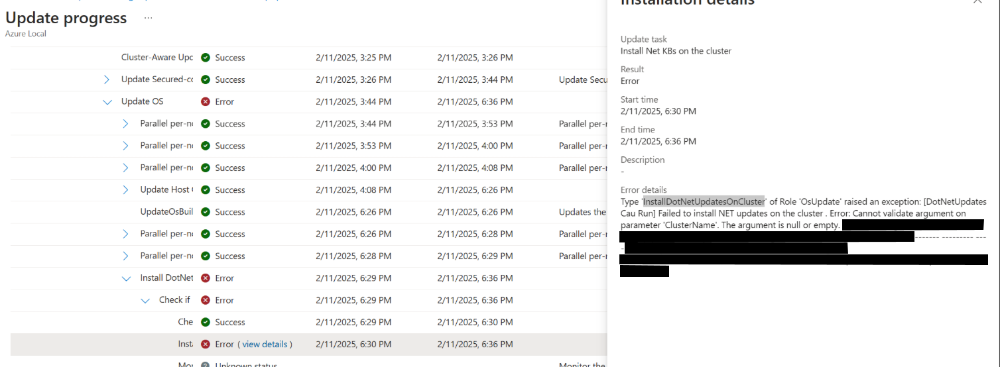

# Overview

As part of Azure Local Update, Cumulative Dot Net Updates are installed using the ValidateDotNetUpdatesOnCluster action under the OsUpdate role.

This TSG has the steps to mitigate the issue where the ValidateDotNetUpdatesOnCluster action fails causing the update to fails with error - Cannot validate argument on parameter 'ClusterName'. The argument is null or empty

# Symptoms

Update fails with the following error message -

Type 'InstallDotNetUpdatesOnCluster' of Role 'OsUpdate' raised an exception: [DotNetUpdates Cau Run] Failed to install NET updates on the cluster . Error: Cannot validate argument on parameter 'ClusterName'. The argument is null or empty. Provide an argument that is not null or empty, and then try the command again



# Cause

On the cluster node, the environment variables CLUSTER_NAME and HCI_RESOURCE_URI are not set/ empty.


# Issue Validation

Check the environment variables on all the nodes to verify if the variables are being set correctly.

```
# Environment variables
[System.Environment]::GetEnvironmentVariables([System.EnvironmentVariableTarget]::Machine) | Out-String
```

This would display all the environment variables. if there are no entries currently for CLUSTER_NAME - then we need to set this variable on the stamp to mitigate the incident. Also, check for the variable HCI_RESOURCE_URI as this uses the cluster name in its value.

# Mitigation Details

In order to mitigate the ICM, the variables CLUSTER_NAME and HCI_RESOURCE_URI need to be set on the node. 

```

# Initialize the environment variables
$clusterName = (Get-Cluster).Name  
$hciResourceUri = (Get-AzureStackHCI).AzureResourceUri  

# Set the environment variables
setx /m CLUSTER_NAME $clusterName  
setx /m HCI_RESOURCE_URI $hciResourceUri

```