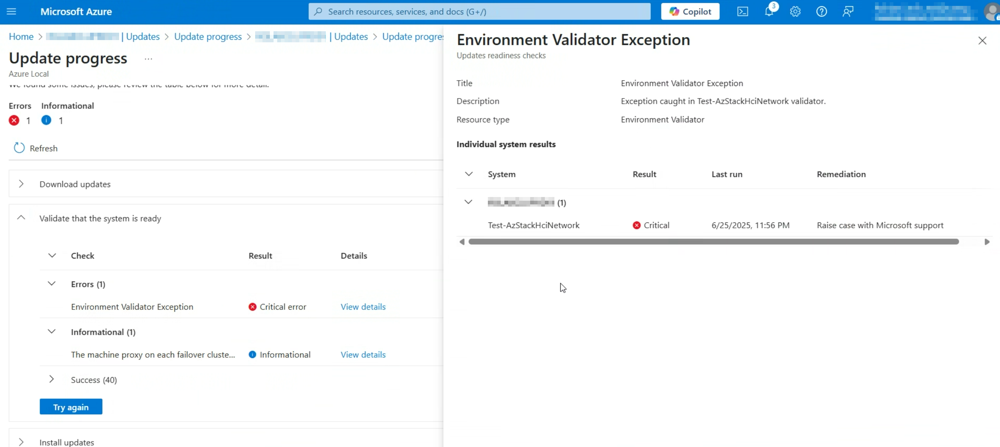

# Summary
Azure Local cluster update to 2505 or 2506 might fail at "Test-AzStackHciNetwork".
When you check the log, you might able to find below error in the latest instance of C:\CloudContent\MASLogs\AzStackHciEnvironmentChecker.log (log file could be on one of the cluster nodes):
```
Exception occurred (Test-AzStackHciNetwork): The term 'EnvValidatorNormalizeIPv4Subnet' is not recognized as the name of a cmdlet
```
In the Azure portal, the message will be something like:
```
Environment Validator Exception | Critical error | Test-AzStackHciNetwork | Raise case with Microsoft support
```



# Symptoms
When Azure Local update to 2505 failed, we can see below problems:
* Solution update failed with "HealthCheckFailed" state
* There is a failed "Check Update readiness" and/or "Check System Update readiness" action plan instance in the system
* There is an exception of "**CloudEngine.Actions.InterfaceInvocationFailedException: Type 'EnvironmentValidatorPreUpdate' of Role 'EnvironmentValidator' raised an exception:**"

Also, the storage adapter(s) on some (if not all) cluster node(s) have multiple valid IP address configured on it.

# Issue Validation
To confirm the scenario that you are encountering is the issue documented in this article, confirm you are seeing the following behavior(s):
* Get-SolutionUpdate | ft Version,State,UpdateStateProperties,HealthState
You should see something like below in the output:
```
Version                     State UpdateStateProperties HealthState
-------                     ----- --------------------- -----------
12.2505.1001.23 HealthCheckFailed                           Failure
```
* Get-ActionPlanInstances | Select-Object ActionPlanName, status, StartDateTime, EndDateTime, InstanceID | Sort-Object EndDateTime | ft
You will see below failed action plan instance(s)
```
Check Update readiness           Failed 5/29/2025 11:54:27 PM 5/30/2025 12:50:25 AM 41c752fa-c333-46a9-b41f-61ea72dd0c7e
Check System Update readiness    Failed 5/30/2025 7:14:26 PM  5/30/2025 7:22:29 PM  870ad365-08d4-4cd5-91a4-22ccf49dd0c1
```
* Start-MonitoringActionPlanInstanceToComplete -ationPlanInstanceID <ACTION PLAN ID GOT FROM ABOVE FAILED "Check Update readiness">
You could see below error information:
```
Error Details:
----------------------------------------
FullStepIndex: 0.0
RolePath: Cloud\Infrastructure\EnvironmentValidator
Interface: EnvironmentValidatorPreUpdate
StackTrace:
CloudEngine.Actions.InterfaceInvocationFailedException: Type 'EnvironmentValidatorPreUpdate' of Role 'EnvironmentValidator' raised an exception:

Failing action plan. Network validator threw and exception
:
Exception occurred (Test-AzStackHciNetwork): The term 'EnvValidatorNormalizeIPv4Subnet' is not recognized as the name of a cmdlet, function, script file, or operable program. Check the spelling of the name, or if a path was included, verify that the path is correct and try again.
```

* Get-NetIPAddress | ft InterfaceIndex, IPAddress, PrefixLength, PrefixOrigin, AddressState, Store
On the cluster node(s), you might see below output while trying to look the storage adapters IP configuration (Note that there are 2 IP on the same interface (with index 15) in below example):
```
InterfaceIndex IPAddress                    PrefixLength    PrefixOrigin    AddressState       Store
-------------- ---------                    ------------    ------------    ------------       -----
15             196.214.96.20                          24          Manual       Preferred    ActiveStore
15             10.71.2.132                            24          Manual       Preferred    ActiveStore
```

# Cause
There are multiple valid IP addresses on each storage adapter in the system. This is not a valid configuration.
We added a new Patch and Update validator from 2505 to block this invalid configuration.
However, there is a bug in the code that we are not able to show the correct mitigation information to end user but just throw an exception. So, end user is not able understand what happened in the system and what is the right mitigation they could take to fix the problem.

# Mitigation Details

To resolve this issue, we need to:
1. Please check what storage adapter the system is using:
    ```
    Get-NetAdapter | ft InterfaceAlias, Status, LinkSpeed
    ```
    * For separate storage configuration, it should be physical adapter(s);
    * For converged storage configuration, it should be adapter(s) with name "vSMB(CONVERGED_INTENTNAME#pNICNAME)" (like "vSMB(mgmtcomputestorage#NIC1)", "vSMB(mgmtcomputestorage#NIC2)").

    Will use "\<STORAGE Adapter Name\>" in below to refer the storage adapters.
2. You could check the current IP of the storage adapters using below cmdlet call on all nodes:
    ```
    Get-NetIPAddress -InterfaceAlias "<STORAGE Adapter Name>" | ft InterfaceAlias, IPAddress, PrefixLength
    ```
3. Verify the storage adapter IP configuration on __all nodes of the cluster__:
    * Please check the IP of the storage adapter and then remove only the IP that you do NOT need anymore.
      Make sure to run this on __all the nodes__.
      ```
      Remove-NetIPAddress -InterfaceAlias "<STORAGE Adapter Name>" -AddressFamily IPv4 -IPAddress "<IP TO REMOVE>" -Confirm:$false
      ```
    Also, make sure you run this "Remove-NetIPAddress" cmdlet for __all the storage adapters__ in the system.

4. Run below script to make sure the storage intent is back to healthy state. This need to be run only once on __one node of the cluster__:
    ```
    [System.String] $currentCluster = (Get-Cluster).Name
    [System.String[]] $allNodes = (Get-ClusterNode).Name
    $storageIntent = Get-NetIntent | Where-Object {$_.IsStorageIntentSet -eq $true}

    foreach ($nodeToCheck in $allNodes) {
        Set-NetIntentRetryState -ClusterName $currentCluster -Name $storageIntent.IntentName -NodeName $nodeToCheck -Wait
    }
    ```

5. Now try to run "Get-NetIPAddress" again, if you find multiple IP for one storage adapter again, then most likely you are using AutoIP
   * Verify the storage intent automatic IP generation setting on __one node of the cluster__:
     ```
     $storageIntent = Get-NetIntent | Where-Object {$_.IsStorageIntentSet -eq $true}
     Write-Host "### AutoIP? [ $($storageIntent.IPOverride.EnableAutomaticIPGeneration) ] ###"
     ```
    The output of above call should be "### AutoIP? [] ###" or "### AutoIP? [ true ] ###"
    You will need to remove a different IP that was used in above step 3: try to run step 3 and step 4 again with a different IP.

### **Additional Notes**
This problem will be fixed in 2508 release and the environment validator will provide more information.
