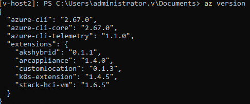

# [2503] UpdatePreRequisites Failure: Remove older extensions (akshybrid, connectedmachine)


When updating to 2503, if the following extensions are installed with the specified version, it could cause failures during UpdatePrerequisites step.

| Az CLI Extension Name     | Version (less or equal)     |
| ------------- | ------------- |
| akshybrid | 0.1.1 |
| hybridaks | 0.2.4 |
| connectedmachine | 1.1.0 |

# Symptoms
After updating the Azure CLI to version 2.67 or higher, sometimes any az cli command will fail with these errors:

*C:\CloudContent\AzCliExtensions\hybridaks\azext_hybridaks\vendored_sdks\hybridaks\models\_models_py3.py:3800: SyntaxWarning: invalid escape sequence '\W'*

*C:\CloudContent\AzCliExtensions\connectedmachine\azext_connectedmachine\aaz\latest\connectedmachine\_delete.py:54: SyntaxWarning: invalid escape sequence '\.'*

# Issue Validation
Run the following command to verify the Azure CLI extensions installed:

`az version`

The following extensions are installed :

| Az CLI Extension Name     | Version (less or equal)     |
| ------------- | ------------- |
| akshybrid | 0.1.1 |
| hybridaks | 0.2.4 |
| connectedmachine | 1.1.0 |

Example for az version output:


# Mitigation Details

To resolve this issue, it is necessary to either update the extensions to their latest version (if possible) in all nodes, or remove them from all nodes.

#### **Step 1: List extensions installed**
Run the following command to list all the Azure CLI extensions installed:

`az version`

#### **Step 2: Confirm if the affected extensions are installed**
Using the output of last step, confirm if these extensions are installed:
| Az CLI Extension Name     | Version (less or equal)     |
| ------------- | ------------- |
| akshybrid | 0.1.1 |
| hybridaks | 0.2.4 |
| connectedmachine | 1.1.0 |

#### **Remove the extension**
The simplest way to address this issue is to remove the extension. These cli extensions are not required for the Update process, so it is fine to remove them.

```Powershell
$moduleName = "akshybrid"
az extension remove --name $moduleName

$moduleName = "connectedmachine"
az extension remove --name $moduleName

$moduleName = "hybridaks"
az extension remove --name $moduleName
```

#### **Step 3: Verify if step 2 has been successful**
Confirm that the extensions have been removed/updated after last step:

`az version`

* * *

### **Additional Notes**

*   These steps have to be run in every node of the cluster